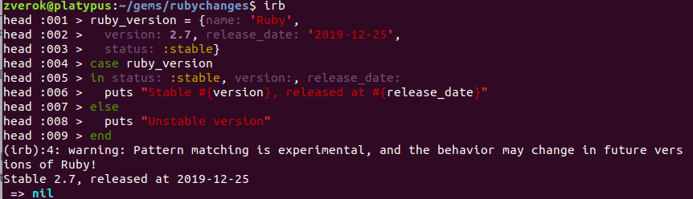

# Ruby 2.7

* **Released at:** Dec 25, 2019 (<a class="github" href="https://github.com/ruby/ruby/blob/ruby_2_7/NEWS">NEWS</a> file)
* **Status (as of Feb 16, 2022):** 2.7.5 is current _stable_
* **This document first published:** Dec 27, 2019
* **Last change to this document:** Feb 16, 2022

<!-- TODO: all links to docs should be replaced with /2.7.0/ suffix instead of /master/ when 2.7.0 would be published -->

## Highlights[](#highlights)

Ruby 2.7 is a last major release before 3.0¹, so it introduces several important changes, larger in scale than previous releases (and also a bit lean on a "just nice to have" features side). Be prepared!

* [Pattern matching](#pattern-matching)
* ["Real" keyword argument](#keyword-argument-related-changes)
* [Numbered block parameters](#numbered-block-parameters)
* [Beginless range](#beginless-range)
* [`Enumerator.produce`](#enumeratorproduce)
* [`GC.compact`](#gccompact)
* [Large update of IRB](#large-irb-update)
* [Serious cleanup of the standard library](#standard-library-contents-change)

<small>¹There is a possibility 2.8 will also be released, but in any case, Christmas release of 2020 is promised to be Ruby 3.0.</small>

## Language[](#language)

### Pattern matching[](#pattern-matching)

Pattern matching is a completely new and experimental feature for structural value checking against patterns, and local variable binding. As it is new and huge, we'll not try to cover the feature here and just send the reader to the <a class="ruby-doc" href="https://docs.ruby-lang.org/en/master/doc/syntax/pattern_matching_rdoc.html">official documentation</a>. Just a small example:

```ruby
require 'open-uri'
require 'json'

data = URI.open('https://api.github.com/repos/ruby/ruby/pulls').read
       .then { |body| JSON.parse(body, symbolize_names: true) }

data in [{user: {login:}, title:, created_at:}, *] # match array of hashes, with deep matching inside first hash

[login, title, created_at] # matched values bound to local variables
#  => ["zverok", "Add pattern matching documentation", "2019-12-25T18:42:03Z"]
```

* **Follow-up:** Pattern matching became a stable (non-experimental) feature, and its power expanded signficantly [in 3.0](#pattern-matching); and then it became even more flexible [in 3.1](3.1.html#pattern-matching).

### Keyword argument-related changes[](#keyword-argument-related-changes)

Ruby 2.7 introduced a lot of changes towards more consistent keyword arguments processing. Fortunately, the official Ruby site has a [full description of those changes](https://www.ruby-lang.org/en/news/2019/12/12/separation-of-positional-and-keyword-arguments-in-ruby-3-0/), with examples, justifications and relationships of features with each other.<br/>
Therefore here we'll just list the changes for the sake of completeness of this changelog.

* Warnings (would be errors in 3.0) for implicit conversion of the last argument-hash to keyword arguments, and vice versa;
* `Module#ruby2_keywords` and `Proc#ruby2_keywords` methods to mark method and proc as not warning when the last argument is used as keyword one (to provide backward- and forward-compatible way of defining "delegating all" methods);
* "Forward all arguments" syntax: `(...)`
* Non-`Symbol` keys are allowed in keyword arguments unpacking;
* `**nil` syntax in method definition to explicitly mark method that doesn't accept keywords (and can't be called with a hash without curly braces);
* empty hash splat doesn't pass empty hash as a positional argument.

* **Follow-up:** Warnings [became errors](3.0.html#keyword-arguments-are-now-fully-separated-from-positional-arguments) in 3.0, and some edge cases [were fixed](3.0.html#procs-with-rest-arguments-and-keywords-change-of-autosplatting-behavior).

### Numbered block parameters[](#numbered-block-parameters)

In block without explicitly specified parameters, variables `_1` through `_9` can be used to reference parameters.

* **Reason:** It is one of the approaches to make short blocks DRY-er and easier to read. E.g. in `filenames.each { |f| File.read(f) }`, repetition of `f` and extra syntax needed for it can be considered an unnecessary verbosity, so `each { File.read(_1) }` could be now used instead.
* **Discussion:** _The feature was discussed for a long time, syntax and semantics was changed several times on the road to 2.7:_
  * <a class="tracker feature" href="https://bugs.ruby-lang.org/issues/4475">Feature #4475</a> (initial discussion, started 9 years ago, and finished with accepting of `@0`—`@9`),
  * <a class="tracker misc" href="https://bugs.ruby-lang.org/issues/15723">Misc #15723</a> (change to `_0`—`_9`),
  * <a class="tracker bug" href="https://bugs.ruby-lang.org/issues/16178">Bug #16178</a> (dropping of `_0`, and changing semantics of `_1`)
* **Documentation:** [Proc#Numbered parameters](https://docs.rubocop.org/en/stable/cops_layout/)
* **Code:**
  ```ruby
  # Simplest usage:
  [10, 20, 30].map { _1**2 }
  # => [100, 400, 900]

  # Multiple block parameters can be accessed as subsequent numbers
  [10, 20, 30].zip([40, 50, 60], [70, 80, 90]).map { _1 + _2 + _3 }
  # => [120, 150, 180]

  # If only _1 is used for multi-argument block, it contains all arguments
  [10, 20, 30].zip([40, 50, 60], [70, 80, 90]).map { _1.join(',') }
  # => ["10,40,70", "20,50,80", "30,60,90"]

  # If the block has explicit parameters, numbered one is SyntaxError
  [10, 20, 30].map { |x| _1**2 }
  # SyntaxError ((irb):1: ordinary parameter is defined)

  # Outside the block, usage is warned:
  _1 = 'test'
  # warning: `_1' is reserved as numbered parameter

  # But after that, _1 references local variable:
  [10].each { p _1 }
  # prints "test"

  # Numbered parameters are reflected in Proc's parameters and arity
  p = proc { _1 + _2 }
  l = lambda { _1 + _2 }
  p.parameters
  # => [[:opt, :_1], [:opt, :_2]]
  p.arity
  # => 2
  l.parameters
  # => [[:req, :_1], [:req, :_2]]
  l.arity
  # => 2

  # Nested blocks with numbered parameters are not allowed:
  %w[test me].each { _1.each_char { p _1 } }
  # SyntaxError (numbered parameter is already used in outer block here)
  # %w[test me].each { _1.each_char { p _1 } }
  #                    ^~
  ```
* **Follow-up:** Warning on attempt to assign to numbered parameter [became errors in 3.0](3.0.html#other-changes).

### Beginless range[](#beginless-range)

In addition to [endless range in Ruby 2.6](2.6.html#endless-range-1): `(start..)`, Ruby 2.7 introduces beginless one: `(..end)`.

* **Reason:** Array slicing (initial justification for endless ranges) turned out to be not the only usage for semi-open ranges. Another ones, like `case`/`grep`, DSLs and constants and [`Comparable#clamp`](#comparableclamp-with-range), can gain from the symmetry of "range without end"/"range without beginning".
* **Discussion:** <a class="tracker feature" href="https://bugs.ruby-lang.org/issues/14799">Feature #14799</a>
* **Documentation:** <a class="ruby-doc" href="https://ruby-doc.org/core-2.7.0/doc/syntax/literals_rdoc.html#label-Ranges"><code>doc/syntax/literals.rdoc#Ranges</code></a>
* **Code:**
  ```ruby
  # Usage examples
  %w[a b c][..1] # same as [0..1], not really useful

  case creation_time
  when ...1.year.ago then 'ancient'
  when 1.year.ago...1.month.ago then 'old'
  when 1.month.ago...1.day.ago then 'recent'
  when 1.day.ago... then 'new'
  end

  users.map(&:age).any?(...18)

  # Properties:
  r = ..10
  r.begin # => nil
  r.count # TypeError (can't iterate from NilClass), same with any other Enumerable methods
  r.size  # => Infinity
  ```
* **Notes:**
  * Slightly "a-grammatical" name ("beginless" instead of "beginningless") is due to the fact that it is a range literally lacking `begin` property.
  * Unfortunately, parser can not always handle beginless range without the help of the parentheses:
  ```ruby
  (1..10).grep ..5
  # ArgumentError (wrong number of arguments (given 0, expected 1))
  # ...because it is in fact parsed as ((1..10).grep()..5), e.g. range from grep results to 5
  ```
  This may seem an esoteric problem, but it becomes less esoteric in DSLs. For example in RubySpec, one would like to write:
  ```ruby
  ruby_version ..'1.9' do
    # some tests for old Ruby
  end
  ```
  ...but the only way is
  ```ruby
  ruby_version(..'1.9') do
    # some tests for old Ruby
  end
  ```

### Other syntax changes[](#other-syntax-changes)

* Comments between `.foo` calls are now allowed:
  ```ruby
  (1..20).select(&:odd?)
         # This was not possible in 2.6
         .map { |x| x**2 }
  # => [1, 9, 25, 49, 81, 121, 169, 225, 289, 361]
  ```
* Quotes (if exist) in HERE-documents should be on the same line as document start:
  ```ruby
   <<"EOS
   " # This had been warned since 2.4; Now it raises a SyntaxError
   EOS
   ```
* Modifier `rescue` parsing change (multiple assignment now consistent with singular):

  ```ruby
  a = raise rescue 1
  # => 1
  a # => 1 in Ruby 2.6 and 2.7

  a, b = raise rescue [1, 2]
  # => [1, 2]

  # 2.6
  a # => nil
  b # => nil
  # The statement parsed as: (a, b = raise) rescue [1, 2]

  # 2.7
  a # => 1
  b # => 2
  # The statement parsed as: a, b = (raise rescue [1, 2])
  ```

### Warnings/deprecations[](#warningsdeprecations)

Some older or accidental features are deprecated on the road to 3.0 and currently produce warnings.

> Note that Ruby 2.7 also [introduced a way](#warning-and-) to turn off only some categories of warnings, for example, only deprecation ones.

* `yield` in singleton class syntax (was inconsistent with local variables accessibility). Discussion: <a class="tracker feature" href="https://bugs.ruby-lang.org/issues/15575">Feature #15575</a>.
  ```ruby
  def foo
    x = 1
    class << Object.new
      p x   # NameError (undefined local variable or method) -- enclosing scope NOT accessible
      yield # calls block passed to foo, implying enclosing scope IS accessible
      # In Ruby 2.7: warning: `yield' in class syntax will not be supported from Ruby 3.0.
    end
  end
  foo { p :ok }
  ```
* `$;` and `$,` global variables (Perl ancestry: default `split` and `join` separators):
  ```ruby
  $; = '???'
  # warning: non-nil $; will be deprecated
  'foo???bar'.split
  # warning: $; is set to non-nil value
  # => ["foo", "bar"]

  $, = '###'
  # warning: non-nil $, will be deprecated
  %w[foo bar].join
  # warning: $, is set to non-nil value
  "foo###bar"
  ```
* Implicit block capturing in `proc` and `lambda`:
  ```ruby
  def foo
    proc.call # here the block passed to method is implicitly captured by proc
  end
  foo { puts "Hello" }
  # warning: Capturing the given block using Kernel#proc is deprecated; use `&block` instead
  # still prints "Hello"
  ```
* Contrastingly, the flip-flop syntax deprecation, [introduced](2.6.html#misc) in 2.6, **is reverted**. It turned out that for brevity in text-processing scrips (including one-liners run as `ruby -e "print <something>"`) the feature, however esoteric it may seem, has a justified usage.
  * **Discussion:** <a class="tracker feature" href="https://bugs.ruby-lang.org/issues/5400#note-23">Feature #5400</a>.
  * **Documentation:** <a class="ruby-doc" href="https://ruby-doc.org/core-2.6.5/doc/syntax/control_expressions_rdoc.html#label-Flip-Flop"><code>doc/syntax/control_expressions.rdoc#Flip-Flop</code></a>
  * **Code:**
    ```ruby
    # Imagine we are working with some data file where real data starts with "<<<"" line and end with ">>>>"
    File.each_line('data.txt', chomp: true).filter_map { |ln| ln if ln == '<<<'..ln == '>>>' }
    # => gets lines starting from <<<, and ending with >>>.
    #   The condition "flips on" when the first part is true, and then "flips off" when the second is true

    # Flip-flop-less version would be something like this (with the difference: it ignores last >>>):
    lines.drop_while { |ln| ln != '<<<' }.take_while { |ln| ln != '>>>' }
    ```
    * **Note:** The BIG difference with "enumerator-based" filtering, which makes flip-flops useful in complicated data processing, is that enumerator's can't express _multiple_ "ons and offs" (imagine file has several `<<< ... >>>` blocks and try to solve the task without flip-flops).

#### "Safe" and "taint" concepts are deprecated in general[](#safe-and-taint-concepts-are-deprecated-in-general)

The concepts of marking objects as <a class="ruby-doc" href="https://ruby-doc.org/core-2.6.5/Object.html#method-i-taint"><code>"tainted"</code></a> (unsafe, came from the outside) and "untaint" them after the check, is for a long time ignored by most of the libraries. `$SAFE` constant, trying to limit "unsafe" calls when set to higher values, is considered a fundamentally flawed method and <a class="ruby-doc" href="https://ruby-doc.org/core-2.0.0/doc/security_rdoc.html#label-24SAFE">documented so since Ruby 2.0</a>. At the same time, as the "official" security features, subtle bugs in implementation of `$SAFE` and tainting have caused lot of "vulnerability reports" and added maintenance burden.

* **Discussion:** <a class="tracker feature" href="https://bugs.ruby-lang.org/issues/16131">Feature #16131</a>

### `self.<private_method>`[](#selfprivate_method)

Calling a private method with a literal `self` as the receiver is now allowed.

* **Reason:** "`anything.method` is always disallowed for private methods" seemed like a simple and unambiguous rule, but produced some ugly edge cases (for example, `self.foo = something` for private `attr_accessor` _was_ allowed). It turned out "allow literal `self.`" makes things much clearer.
* **Discussion:** <a class="tracker feature" href="https://bugs.ruby-lang.org/issues/11297">Feature #11297</a>, <a class="tracker feature" href="https://bugs.ruby-lang.org/issues/16123">Feature #16123</a>
* **Documentation:** <a class="ruby-doc" href="https://ruby-doc.org/core-2.7.0/doc/syntax/modules_and_classes_rdoc.html#label-Visibility"><code>doc/syntax/modules_and_classes.rdoc#Visibility</code></a>
* **Code:**
  ```ruby
  class A
    def update
      self.a = 42 # works even in Ruby 2.6, because there was no other way to call private setter
      self.a += 42 # "private method `a' called" in 2.6, works in 2.7

      self + 42 # "private method `+' called" in 2.6, works in 2.7

      x = self
      x.a = 42 # "private method `a=' called" even in 2.7, not a literal self
    end

    private

    attr_accessor :a

    def +(other)
      puts "+ called"
    end
  end
  ```

### Refinements in `#method`/`#instance_method`[](#refinements-in-methodinstance_method)


* **Discussion:** <a class="tracker feature" href="https://bugs.ruby-lang.org/issues/15373">Feature #15373</a>
* **Code:**
  ```ruby
  module StringExt
    refine String do
      def wrap(what)
        before, after = self.split('|', 2)
        "#{before}#{what}#{after}"
      end
    end
  end

  using StringExt

  '<<|>>'.method(:wrap)
  # => #<Method: String(#<refinement:String@StringExt>)#wrap(what) refinement_test.rb:3>

  %w[test me please].map(&'<<|>>'.method(:wrap))
  # 2.6: undefined method `wrap' for class `String'
  # 2.7: => ["<<test>>", "<<me>>", "<<please>>"]
  ```

## Core classes and modules[](#core-classes-and-modules)

### Better `Method#inspect`[](#better-methodinspect)

`Method#inspect` now shows method's arguments and source location (if available).

* **Reason:** As there are more code style approaches that operate `Method` objects, making them better identifiable and informative seemed necessary.
* **Discussion:** <a class="tracker feature" href="https://bugs.ruby-lang.org/issues/14145">Feature #14145</a>
* **Documentation:** <a class="ruby-doc" href="https://ruby-doc.org/core-2.7.0/Method.html#method-i-inspect"><code>Method#inspect</code></a>
* **Code:**
  ```ruby
  p CSV.method(:read)
  # Ruby 2.6:
  #   => #<Method: CSV.read>
  # Ruby 2.7:
  #   => #<Method: CSV.read(path, **options) <...>/lib/ruby/2.7.0/csv.rb:714>

  # For methods defined in C, path and param names aren't available, but at least generic signature is:
  [].method(:at)
  # => #<Method: Array#at(_)>

  # Convention: unknown param name is displayed as _, param has default value -- as ...
  def m(a, b=nil, *c, d:, e: nil, **rest, &block)
  end

  p method(:m)
  #=> #<Method: m(a, b=..., *c, d:, e: ..., **rest, &block) ...skip...>
  ```
* **Notes:**
  * while enhancing `Method#inspect`, `Proc`'s string representation also changed for consistency: now object id separated from location by ` ` (for easier copy-pasting). Discussion: <a class="tracker feature" href="https://bugs.ruby-lang.org/issues/16101">Feature #16101</a>
  ```ruby
  p(proc {})
  # Ruby 2.6:
  #   => #<Proc:0x000055e4d93f2708@(irb):13>
  # Ruby 2.7:
  #   => #<Proc:0x000055e4d93f2708 (irb):13>
  ```
  * The same is related to `Thread`. Discussion: <a class="tracker feature" href="https://bugs.ruby-lang.org/issues/16412">Feature #16412</a>
  ```ruby
  p(Thread.new {})
  # Ruby 2.6:
  #   => #<Thread:0x000055be3d72fcd0@(irb):2 run>
  # Ruby 2.7:
  #   => #<Thread:0x0000561efab16560 (irb):2 run>
  ```

### `UnboundMethod#bind_call`[](#unboundmethodbind_call)

Binds `UnboundMethod` to a receiver and calls it. Semantically equivalent to `unbound_method.bind(receiver).call(arguments)`, but doesn't produce intermediate `Method` object (which `bind` does).

* **Reason:** The technique of storing unbound methods and binding them later is used in some metaprogramming-heavy code to robustly use "original" implementation. For example:
  ```ruby
  MODULE_NAME = Module.instance_method(:name)

  class Customer
    def self.name
      "<Customer Model>"
    end
  end

  Customer.name # => "<Customer Model>"
  MODULE_NAME.bind_call(Customer) # => "Customer"
  ```
  In such cases (for example, code reloaders), overhead of producing new `Method` object on each `bind().call` is pretty significant, and `bind_call` allows to avoid it.
* **Discussion:** <a class="tracker feature" href="https://bugs.ruby-lang.org/issues/15955">Feature #15955</a>
* **Documentation:** <a class="ruby-doc" href="https://ruby-doc.org/core-2.7.0/UnboundMethod.html#method-i-bind_call"><code>UnboundMethod#bind_call</code></a>

### `Module`[](#module)

#### `#const_source_location`[](#const_source_location)

Returns the location of the _first_ definition of the specified constant.

* **Discussion:** <a class="tracker feature" href="https://bugs.ruby-lang.org/issues/10771">Feature #10771</a>
* **Documentation:** <a class="ruby-doc" href="https://ruby-doc.org/core-2.7.0/Module.html#method-i-const_source_location"><code>Module#const_source_location</code></a>
* **Code:**
  ```ruby
  # Assuming test.rb:
  class A
    C1 = 1
  end

  module M
    C2 = 2
  end

  class B < A
    include M
    C3 = 3
  end

  class A # continuation of A definition
  end

  p B.const_source_location('C3')           # => ["test.rb", 11]
  p B.const_source_location('C2')           # => ["test.rb", 6]
  p B.const_source_location('C1')           # => ["test.rb", 2]
  p B.const_source_location('C4')           # => nil  -- constant is not defined

  p B.const_source_location('C2', false)    # => nil  -- don't lookup in ancestors

  p Object.const_source_location('B')       # => ["test.rb", 9]
  p Object.const_source_location('A')       # => ["test.rb", 1]  -- note it is first entry, not "continuation"

  p B.const_source_location('A')            # => ["test.rb", 1]  -- because Object is in ancestors
  p M.const_source_location('A')            # => ["test.rb", 1]  -- Object is not ancestor, but additionally checked for modules

  p Object.const_source_location('A::C1')   # => ["test.rb", 2]  -- nesting is supported
  p Object.const_source_location('String')  # => []  -- constant is defined in C code
  ```

#### `#autoload?`: `inherit` argument[](#autoload-inherit-argument)

* **Reason:** More granular checking "if something is marked to be autoloaded directly or through ancestry chain" is necessary for advanced code reloaders (requested by author of <a class="github" href="https://github.com/fxn/zeitwerk">zeitwerk</a>).
* **Discussion:** <a class="tracker feature" href="https://bugs.ruby-lang.org/issues/15777">Feature #15777</a>
* **Documentation:** <a class="ruby-doc" href="https://ruby-doc.org/core-2.7.0/Module.html#method-i-autoload-3F"><code>Module#autoload?</code></a>
* **Code:**
  ```ruby
  class Parent
    autoload :Feature1, 'feature1.rb'
  end

  module Mixin
    autoload :Feature2, 'feature2.rb'
  end

  class Child < Parent
    include Mixin
  end

  Child.autoload?(:Feature1)        # => "feature1.rb"
  Child.autoload?(:Feature1, false) # => nil
  Child.autoload?(:Feature2)        # => "feature2.rb"
  Child.autoload?(:Feature2, false) # => nil
  ```

### `Comparable#clamp` with `Range`[](#comparableclamp-with-range)

`Comparable#clamp` now can accept `Range` as its only argument, including beginless and endless ranges.

* **Reason:** First, ranges can be seen as more "natural" to specify _a range_ of acceptable values. Second, with introduction of beginless and endless ranges, `#clamp` now can be used for one-sided value limitation, too.
* **Discussion:** <a class="tracker feature" href="https://bugs.ruby-lang.org/issues/14784">Feature #14784</a>
* **Documentation:** <a class="ruby-doc" href="https://ruby-doc.org/core-2.7.0/Comparable.html#method-i-clamp"><code>Comparable#clamp</code></a>
* **Code:**
  ```ruby
  123.clamp(0..100) # => 100
  -20.clamp(0..100) # => 0
  15.clamp(0..100) # => 15

  # With semi-open ranges:
  123.clamp(150..) # => 150
  123.clamp(..120) # => 120

  # Range with excluding end is not allowed
  123.clamp(0...150) # ArgumentError (cannot clamp with an exclusive range)

  # Old two-argument form still works:
  123.clamp(0, 150)
  # => 123
  ```

### `Integer[]` with range[](#integer-with-range)

Allows to get several bits at once.

* **Discussion:** <a class="tracker feature" href="https://bugs.ruby-lang.org/issues/8842">Feature #8842</a>
* **Documentation:** <a class="ruby-doc" href="https://ruby-doc.org/core-2.7.0/Integer.html#method-i-5B-5D"><code>Integer#[]</code></a>
* **Code:**
  ```ruby
  #    4---0
  #    v   v
  0b10101001[0..4] # => 9
  0b10101001[0..4].to_s(2)
  # => "1001"
  ```

### `Complex#<=>`[](#complex)

`Complex#<=>(other)` now returns `nil` if the number has imaginary part, and behaves like `Numeric#<=>` if it does not.

* **Reason:** Method `#<=>` was explicitly undefined in `Complex` to underline the fact that linear order of complex numbers can't be established, but it was inconsistent with most of the other objects implementations (which return `nil` for impossible/incompatible comparison instead of raising)
* **Discussion:** <a class="tracker bug" href="https://bugs.ruby-lang.org/issues/15857">Bug #15857</a>
* **Documentation:** <a class="ruby-doc" href="https://ruby-doc.org/core-2.7.0/Complex.html#method-i-3C-3D-3E"><code>Complex#<=></code></a>
* **Code:**
  ```ruby
  1 + 2i <=> 1 # => nil
  1 + 2i <=> 1 + 2i # => nil, even if numbers are equal
  1 + 0i <=> 2 # => -1
  ```

### Strings, symbols and regexps[](#strings-symbols-and-regexps)

* **Unicode version:** 12.1
* **New encodigs:** [CESU-8](https://en.wikipedia.org/wiki/CESU-8)

#### Core methods returning frozen strings[](#core-methods-returning-frozen-strings)

Several core methods now return frozen, deduplicated `String` instead of generating it every time the string is requested.

* **Reason:** Avoiding allocations of new strings for each `#to_s` of primitive objects can save dramatic amounts of memory.
* **Discussion:** <a class="tracker feature" href="https://bugs.ruby-lang.org/issues/16150">Feature #16150</a>
* **Affected methods:** <a class="ruby-doc" href="https://ruby-doc.org/core-2.7.0/NilClass.html#method-i-to_s"><code>NilClass#to_s</code></a>, <a class="ruby-doc" href="https://ruby-doc.org/core-2.7.0/TrueClass.html#method-i-to_s"><code>TrueClass#to_s</code></a>, <a class="ruby-doc" href="https://ruby-doc.org/core-2.7.0/TrueClass.html#method-i-to_s"><code>FalseClass#to_s</code></a>, <a class="ruby-doc" href="https://ruby-doc.org/core-2.7.0/Module.html#method-i-name"><code>Module#name</code></a>
* **Code:**
  ```ruby
  # Ruby 2.6
  true.to_s.frozen? # => false
  3.times.map { true.to_s.object_id }
  # => [47224710953060, 47224710953040, 47224710953000] -- every time new object

  # Ruby 2.7
  true.to_s.frozen? # => true
  3.times.map { true.to_s.object_id }
  # => [180, 180, 180] -- frozen special string
  ```
* **Notes:**
  * Change introduces incompatibility for the code looking like:
  ```ruby
  value = true
  # ...
  buffer = value.to_s
  buffer << ' -- received'
  # Ruby 2.6: "true -- received"
  # Ruby 2.7: FrozenError (can't modify frozen String: "true")
  ```
  * The same change was proposed for `Symbol#to_s` (and could've been a dramatic improvement in some kinds of code), but the change turned out to be too disruptive.
* **Follow-up:** Instead of freezin `Symbol#to_s`, new method `Symbol#name` returning frozen string [was introduced](3.0.html#symbolname) in 3.0.

#### `Symbol#start_with?` and `#end_with?`[](#symbolstart_with-and-end_with)

* **Reason:** Symbol was once thought as "just immutable names" with any of "string-y" operations not making sense for them, but as `Symbol#match` was always present, and `Symbol#match?` [implemented in 2.4](2.4.html#match-method), it turns out that other content inspection methods are also useful.
* **Discussion:** <a class="tracker feature" href="https://bugs.ruby-lang.org/issues/16348">Feature #16348</a>
* **Documentation:** <a class="ruby-doc" href="https://ruby-doc.org/core-2.7.0/Symbol.html#method-i-end_with-3F"><code>Symbol#end_with?</code></a>, <a class="ruby-doc" href="https://ruby-doc.org/core-2.7.0/Symbol.html#method-i-start_with-3F"><code>Symbol#start_with?</code></a>
* **Code:**
  ```ruby
  :table_name.end_with?('name', 'value')
  # => true
  :table_name.start_with?('table', 'index')
  # => true

  # Somewhat confusingly, Symbol arguments are not supported
  :table_name.end_with?(:name, 'value')
  # TypeError (no implicit conversion of Symbol into String)
  ```

### `Time`[](#time)

#### `#floor` and `#ceil`[](#floor-and-ceil)

Rounds Time's nanoseconds down or up to a specified number of digits (0 by default, e.g. round to whole seconds).

* **Reason:** Rounding of nanoseconds important in a test code, when comparing `Time` instances from a different sources (stored in DB, passed through third-party libraries, etc.). Having better control on truncation comparing to `Time#round` (which existed since 1.9.2)
* **Discussion:** <a class="tracker feature" href="https://bugs.ruby-lang.org/issues/15653">Feature #15653</a> (floor, Japanese), <a class="tracker feature" href="https://bugs.ruby-lang.org/issues/15772">Feature #15772</a> (ceil)
* **Documentation:** <a class="ruby-doc" href="https://ruby-doc.org/core-2.7.0/Time.html#method-i-floor"><code>Time#floor</code></a>, <a class="ruby-doc" href="https://ruby-doc.org/core-2.7.0/Time.html#method-i-ceil"><code>Time#ceil</code></a>
* **Code:**
  ```ruby
  t = Time.utc(2019, 12, 24, 5, 43, 25.8765432r)
  t.floor     # => 2019-12-24 05:43:25 UTC
  t.floor(2)  # => 2019-12-24 05:43:25.87 UTC

  t.ceil      # => 2019-12-24 05:43:26 UTC
  t.ceil(2)   # => 2019-12-24 05:43:25.88 UTC
  ```

#### `#inspect` includes subseconds[](#inspect-includes-subseconds)

* **Reason:** Losing subseconds in `#inspect` always made debugging and testing harder, producing test failures like "Expected: 2019-12-21 16:11:08 +0200, got 2019-12-21 16:11:08 +0200" (which are visually the same, but one of them, probably going through some serialization or DB storage, has different value for subseconds).
* **Discussion:** <a class="tracker feature" href="https://bugs.ruby-lang.org/issues/15958">Feature #15958</a>
* **Documentation:** <a class="ruby-doc" href="https://ruby-doc.org/core-2.7.0/Time.html#method-i-inspect"><code>Time#inspect</code></a>
* **Code:**
  ```ruby
  t = Time.utc(2019, 12, 24, 5, 43, 25.8765432r)
  p t
  # Ruby 2.6: prints "2019-12-24 05:43:25 UTC"
  # Ruby 2.7: prints "2019-12-24 05:43:25.8765432 UTC"
  puts t
  # always prints "2019-12-24 05:43:25 UTC"

  # Note that sometimes representation falls back to Rational fractions:
  t2 = Time.utc(2019,12,31, 23,59,59) + 1.4
  p t2
  # => 2020-01-01 00:00:00 900719925474099/2251799813685248 UTC
  # That's when subseconds can't be represented as 9-digit whole number:
  (t.subsec * 10**9).to_f
  # => 876543200.0
  (t2.subsec * 10**9).to_f
  # => 399999999.99999994
  ```

### Enumerables and collections[](#enumerables-and-collections)

#### `Enumerable#filter_map`[](#enumerablefilter_map)

Transforms elements of enumerable with provided block, and drops falsy results, in one pass.

* **Reason:** Filter suitable elements, then process them somehow is a common flow of sequence processing, yet with `filter { ... }.map { ... }` additional intermediate `Array` is produced, which is not always desirable. Also, some processing can indicate "can't be processed" by returning `false` or `nil`, which requires code like `map { ... }.compact` (to drop `nil`s) or `map { ... }.select(:itself)` (to drop all falsy values).
* **Discussion:** <a class="tracker feature" href="https://bugs.ruby-lang.org/issues/15323">Feature #15323</a>
* **Documentation:** <a class="ruby-doc" href="https://ruby-doc.org/core-2.7.0/Enumerable.html#method-i-filter_map"><code>Enumerable#filter_map</code></a>
* **Code:**
  ```ruby
  (1..10).filter_map { |i| i**2 if i.even? } # => [4, 16, 36, 64, 100]

  # imagine method constantize() returning false if string can't be converted to
  # a proper constant name
  constant_names = %w[foo 123 _ bar baz/test].filter_map { |str| constantize(str) } # => ['Foo', 'Bar']

  # Without block, returns Enumerator:
  %w[foo bar baz test].filter_map
                      .with_index { |str, i| str.capitalize if i.even? }
  # => ["Foo", "Baz"]
  ```

#### `Enumerable#tally`[](#enumerabletally)

Counts unique objects in the enumerable and returns hash of `{object => count}`.

* **Discussion:** <a class="tracker feature" href="https://bugs.ruby-lang.org/issues/11076">Feature #11076</a>
* **Documentation:** <a class="ruby-doc" href="https://ruby-doc.org/core-2.7.0/Enumerable.html#method-i-tally"><code>Enumerable#tally</code></a>
* **Code:**
  ```ruby
  %w[Ruby Python Ruby Perl Python Ruby].tally
  # => {"Ruby"=>3, "Python"=>2, "Perl"=>1}
  ```
* **Notes:**
  * `#tally` follows `#to_h` intuitions (and uses it underneath): objects are considered same if they have the same `#hash`; orders of keys corresponds to order of appearance in sequence; first object in sequence becomes the key
  * Additional block argument, or, alternatively, additional method `tally_by(&block)` was proposed in the same ticket to allow code like
  ```ruby
  (1..10).tally_by(&:even?) # => {true => 5, false => 5}
  ```
  ...but was not accepted yet.
* **Follow-up:** In Ruby 3.1, `#tally(hash)` [was introduced](3.1.html#enumerabletally-now-accepts-an-optional-hash-to-count) to accumulate statistics from several collections into a single hash.

#### `Enumerator.produce`[](#enumeratorproduce)

Produces infinite enumerator by calling provided block and passing its result to subsequent block call.

* **Reason:** `.produce` allows to convert any `while`-alike or `loop`-alike loops into enumerators, making possible to work with them in a Ruby-idiomatic `Enumerable` style.
* **Discussion:** <a class="tracker feature" href="https://bugs.ruby-lang.org/issues/14781">Feature #14781</a>
* **Documentation:** [Enumerator.produce]()
* **Code:**
  ```ruby
  require 'date'
  # Before: while cycle to search next tuesday:
  d = Date.today
  while !d.tuesday
    d += 1
  end
  # After: enumerator:
  Enumerator.produce(Date.today, &:succ) # => enumerator of infinitely increasing dates
            .find(&:tuesday?)

  require 'strscan'
  PATTERN = %r{\d+|[-/+*]}
  scanner = StringScanner.new('7+38/6')
  # Before: while cycle to implement simple lexer:
  result =
  result << scanner.scan(PATTERN) while !scanner.eos?
  # After: achieving the same with enumerator (which can be passed to other methods to process):
  Enumerator.produce { scanner.scan(PATTERN) }.slice_after { scanner.eos? }.first
  # => ["7", "+", "38", "/", "6"]

  # Raising StopIteration allows to stop the iteration:
  ancestors = Enumerator.produce(node) { |prev| prev.parent or raise StopIteration }
  # => enumerator
  enclosing_section = ancestors.find { |n| n.type == :section } # => :section node or nil

  # If the initial value is passed, it is an argument to first block call, and yielded as a first
  # value of enumerator
  Enumerator.produce(1) { |prev| p "PREVIOUS: #{prev}"; prev + 1 }.take(3)
  # "PREVIOUS: 1"
  # "PREVIOUS: 2"
  #  => [1, 2, 3]

  # If the initial value is not passed, first block call receives `nil`, and the block's first result
  # is yielded as a first value of enumerator
  Enumerator.produce { |prev| p "PREVIOUS: #{prev.inspect}"; (prev || 0) + 1 }.take(3)
  # "PREVIOUS: nil"
  # "PREVIOUS: 1"
  # "PREVIOUS: 2"
  #  => [1, 2, 3]
  ```

#### `Enumerator::Lazy#eager`[](#enumeratorlazyeager)

Converts lazy enumerator back to eager one.

* **Reason:** When working with large data sequences, lazy enumerators are useful tools to not produce intermediate array on each step. But some data consuming methods expect to receive enumerators that would really return data from methods like `take_while` and not just add them to pipeline.
* **Discussion:** <a class="tracker feature" href="https://bugs.ruby-lang.org/issues/15901">Feature #15901</a>
* **Documentation:** <a class="ruby-doc" href="https://ruby-doc.org/core-2.7.0/Enumerator/Lazy.html#method-i-eager"><code>Enumerator::Lazy#eager</code></a>
* **Code:**
  ```ruby
  # Imagine we read very large data file:
  lines =
    File.open('data.csv')
        .each_line
        .lazy
        .map { |ln| ln.sub(/\#.+$/, '').strip } # remove "comments"
        .reject(&:empty?)  # drop empty lines
  p lines
  # => #<Enumerator::Lazy: ....>

  # Now, we want to consume just "headers" from this CSV, and pass the rest of enumerator
  # into the other methods.

  # This code:
  headers = lines.take_while { |ln| ln.start_with?('$$$') }
  # ...will just produce another lazy enumerator, with `take_while` chained to pipeline.

  # Now, this:
  lines = lines.eager # makes the enumerator eager, but (unlike `#force`) doesn't consume it yet
  p lines
  # => #<Enumerator: #<Enumerator::Lazy: ...>:each>

  # consumes only several first lines and returns array of headers
  headers = lines.take_while { |ln| ln.start_with?('$$$') }
  # => [array, of, header, lines]

  # now we can pass `lines` to methods that expect take_while/take and other similar methods to
  # consume enumerator partially and return arrays
  ```

#### `Enumerator::Yielder#to_proc`[](#enumeratoryielderto_proc)

* **Reason:** When constructing the enumerator, value yielding is frequently delegated to other methods, which accept blocks. Before the change, it was inconvenient to delegate.
* **Discussion:** <a class="tracker feature" href="https://bugs.ruby-lang.org/issues/15618">Feature #15618</a>
* **Documentation:** <a class="ruby-doc" href="https://ruby-doc.org/core-2.7.0/Enumerator/Yielder.html#method-i-to_proc"><code>Enumerator::Yielder#to_proc</code></a>
* **Code:**
  ```ruby
  # Construct a enumerator which will pass all lines from all files from some folder:

  # Before the change:
  all_lines = Enumerator.new { |y| # y is Yielder object here
    Dir.glob("*.rb") { |file|
      File.open(file) { |f| f.each_line { |ln| y << ln } }
    }
  }

  # After the change:
  all_lines = Enumerator.new { |y| # y is Yielder object here
    Dir.glob("*.rb") { |file|
      File.open(file) { |f| f.each_line(&y) }
    }
  }
  ```

#### `Array#intersection`[](#arrayintersection)

Like `Array#union` and `#difference`, [added](2.6.html#arrayunion-and-arraydifference) in 2.6 as a explicitly-named and accepting multiple arguments alternatives for `#|` and `#-`, the new method is alternative for `#&`.

* **Discussion:** <a class="tracker feature" href="https://bugs.ruby-lang.org/issues/16155">Feature #16155</a>
* **Documentation:** <a class="ruby-doc" href="https://ruby-doc.org/core-2.7.0/Array.html#method-i-intersection"><code>Array#intersection</code></a>
* **Code:**
  ```ruby
  ['Ruby', 'Python', 'Perl'].intersection(['Ruby', 'Diamond', 'Perl'], ['Ruby', 'Nikole', 'Kate']) # => ["Ruby"]

  ['Ruby', 'Python', 'Perl'].intersection # => ["Ruby", "Python", "Perl"]
  ```
* **Follow-up:** Ruby 3.1 [introduced](3.1.html#arrayintersect) `Array#intersect?` predicate.

#### `ObjectSpace::WeakMap#[]=` now accepts non-GC-able objects[](#objectspaceweakmap-now-accepts-non-gc-able-objects)

* **Reason:** `ObjectSpace::WeakMap` (the `Hash` variety that doesn't hold its contents from being garbage-collected) is mostly thought, as the name implies, as an "internal" thing. But turns out it can have some legitimate usages in a regular code, for example, implementing flexible caching (cache which "auto-cleans" on garbage collection). But before this change, keys for `WeekMap` wasn't allowed to be non-GC-able (for example, numbers and symbols), which prohibits some interesting usages.
* **Discussion:** <a class="tracker feature" href="https://bugs.ruby-lang.org/issues/16035">Feature #16035</a>
* **Documentation:** <a class="ruby-doc" href="https://ruby-doc.org/core-2.7.0/ObjectSpace/WeakMap.html#method-i-5B-5D-3D"><code>WeekMap#[]=</code></a>
* **Code:**
  ```ruby
  map = ObjectSpace::WeakMap.new
  map[1] = Object.new
  # Ruby 2.6: ArgumentError (cannot define finalizer for Integer)
  # Ruby 2.7: Writes the map successfully
  map[1]
  # => #<Object:0x0000561ea70ec3d0>
  GC.start
  map[1]
  # => nil  -- value successfully collected, even if key was not GC-able
  ```

### `Fiber#raise`[](#fiberraise)

Raises exception inside the resumed Fiber.

* **Reason:** Ability to raise an exception inside Fiber makes control passing abilities more feature-complete.
* **Discussion:** <a class="tracker feature" href="https://bugs.ruby-lang.org/issues/10344">Feature #10344</a>
* **Documentation:** <a class="ruby-doc" href="https://ruby-doc.org/core-2.7.0/Fiber.html#method-i-raise"><code>Fiber#raise</code></a>
* **Code:**
  ```ruby
  f = Fiber.new {
    Enumerator.produce { Fiber.yield } # Infinite yielding enumerator, breaks on StopIteration
              .to_a.join(', ')
  }
  f.resume
  f.resume 1
  f.resume 2
  f.resume 3
  f.raise StopIteration # => "1, 2, 3"
  ```
* **Notes:** `Fiber#raise` has the same call sequence as `Kernel#raise` and can be called without any arguments (`RuntimeError` is empty message is raised), with string (`RuntimeError` with provided message is raised), exception class and (optional) message, or instance of the exception.

### `Range`[](#range)

#### `#===` for `String`[](#for-string)

In 2.6, `Range#===` was changed to use `#cover?` underneath, but not for `String`. This was fixed.

* **Discussion:** <a class="tracker bug" href="https://bugs.ruby-lang.org/issues/15449">Bug #15449</a>
* **Documentation:** <a class="ruby-doc" href="https://ruby-doc.org/core-2.7.0/Range.html#method-i-3D-3D-3D"><code>Range#===</code></a>
* **Code:**
  ```ruby
  case '2.6.5'
  when '2.4'..'2.7'
    'matches'
  else
    'nope :('
  end
  # => "nope :(" in 2.6, "matches" in 2.7
  ```

#### `#minmax` implementation change[](#minmax-implementation-change)

`Range#minmax` switched to returning `Range#end` instead of iterating through Range to get maximum value.

* **Reason:** `Range#minmax` was previously implemented in `Enumerable`, giving some inconsistencies with separate `#min` and `#max` in edge cases like:
  ```ruby
  (1..).max #=> RangeError (cannot get the maximum of endless range)
  (1..).minmax #=> Runs forever, trying to iterate while it is not exhausted
  ("a".."aa").max #=> "aa"
  ("a".."aa").minmax #=> ["a","z"] -- iteration through range goes till "aa", but then "aa" < "z", so "z" is maximum
  ```
* **Discussion:** <a class="tracker feature" href="https://bugs.ruby-lang.org/issues/15807">Feature #15807</a>
* **Documentation:** <a class="ruby-doc" href="https://ruby-doc.org/core-2.7.0/Range.html#method-i-minmax"><code>Range#minmax</code></a>
* **Code:**
  ```ruby
  (1..).minmax # => RangeError (cannot get the maximum of endless range)
  (1..Float::INFINITY).minmax # => [1, Infinity]
  ("a".."aa").minmax # => ["a", "aa"]
  ```

* **Note:** As can be seen in String example, sometimes `#minmax` (as well as `#max`) can yield unexpected result (the value which is in fact _not_ the maximum of all Range contents). This is true for value types with ambiguous order definition ("zz" is _between_ "a" and "aa" in enumeration, yet still _larger_ than "aa").

### Filesystem and IO[](#filesystem-and-io)

#### `IO#set_encoding_by_bom`[](#ioset_encoding_by_bom)

Auto-sets encoding to UTF-8 if byte-order mark is present in the stream.

* **Discussion:** <a class="tracker feature" href="https://bugs.ruby-lang.org/issues/15210">Feature #15210</a>
* **Documentation:** <a class="ruby-doc" href="https://ruby-doc.org/core-2.7.0/IO.html#method-i-set_encoding_by_bom"><code>IO#set_encoding_by_bom</code></a>
* **Code:**
  ```ruby
  File.write("tmp/bom.txt", "\u{FEFF}мама")
  ios = File.open("tmp/bom.txt", "rb")
  ios.binmode? # => true
  ios.external_encoding # => #<Encoding:ASCII-8BIT>
  ios.set_encoding_by_bom # => #<Encoding:UTF-8>
  ios.external_encoding # => #<Encoding:UTF-8>
  ios.read # => "мама"

  File.write("tmp/nobom.txt", "мама")
  ios = File.open("tmp/nobom.txt", "rb")
  ios.set_encoding_by_bom # => nil
  ios.external_encoding # => #<Encoding:ASCII-8BIT>
  ios.read # => "\xD0\xBC\xD0\xB0\xD0\xBC\xD0\xB0"

  # The method raises in non-binary-mode streams, or if encoding already set:
  File.open("tmp/bom.txt", "r").set_encoding_by_bom
  # ArgumentError (ASCII incompatible encoding needs binmode)
  File.open("tmp/bom.txt", "rb", encoding: 'Windows-1251').set_encoding_by_bom
  # ArgumentError (encoding is set to Windows-1251 already)
  ```

#### `Dir.glob` and `Dir.[]` not allow `\0`-separated patterns[](#dirglob-and-dir-not-allow-0-separated-patterns)

* **Discussion:** <a class="tracker feature" href="https://bugs.ruby-lang.org/issues/14643">Feature #14643</a>
* **Documentation:** <a class="ruby-doc" href="https://ruby-doc.org/core-2.7.0/Dir.html#method-c-glob"><code>Dir.glob</code></a>
* **Code:**
  ```ruby
  Dir.glob("*.rb\0*.md")
  # 2.6:
  #   warning: use glob patterns list instead of nul-separated patterns
  #   => ["2.5.md", "History.md", "README.md" ...
  # 2.7
  #   ArgumentError (nul-separated glob pattern is deprecated)

  # Proper alternative, works in 2.7 and earlier versions:
  Dir.glob(["*.rb", "*.md"])
  # => ["2.5.md", "History.md", "README.md" ...
  ```

#### `File.extname` returns a `"."` string at a name ending with a dot.[](#fileextname-returns-a--string-at-a-name-ending-with-a-dot)

* **Reason:** It is argued that `File.basename(str, '.*') + File.extname(str)` should always reconstruct the full name, but it was not the case for names like `image.`
* **Discussion:** <a class="tracker bug" href="https://bugs.ruby-lang.org/issues/15267">Bug #15267</a>
* **Documentation:** [File.extname](https://bugs.ruby-lang.org/issues/15267)
* **Code:**
  ```ruby
  filename = "image."
  [File.basename(filename, ".*"), File.extname(filename)]
  # 2.6: => ["image", ""]   -- the dot is lost
  # 2.7: => ["image", "."]
  ```

### Exceptions[](#exceptions)

#### `FrozenError`: receiver argument[](#frozenerror-receiver-argument)

In 2.6 several exception class constructors [were enhanced](2.6.html#new-arguments-receiver-and-key) so the user code could create them providing context, now `FrozenError` also got this functionality.

* **Discussion:** <a class="tracker feature" href="https://bugs.ruby-lang.org/issues/15751">Feature #15751</a>
* **Documentation:** <a class="ruby-doc" href="https://ruby-doc.org/core-2.7.0/FrozenError.html#method-c-new"><code>FrozenError#new</code></a>
* **Code:**
  ```ruby
  class AlwaysFrozenHash < Hash
    # ...
    def update!(*)
      raise FrozenError.new("I am frozen!", receiver: self)
    end
  end
  ```
* **Notice:** `<Exception>.new` syntax is the only way to pass new arguments, this would **not** work:
  ```ruby
  raise FrozenError, "I am frozen!", receiver: self
  ```

### Interpreter internals[](#interpreter-internals)

#### `$LOAD_PATH.resolve_feature_path`[](#load_pathresolve_feature_path)

`resolve_feature_path` was [introduced](2.6.html#rubyvmresolve_feature_path) in Ruby 2.6 as `RubyVM` method, now it is singleton method of `$LOAD_PATH` global variable.

* **Reason:** It was argued that `RubyVM` should contain code specific for particular Ruby implementation (e.g. it can be different between CRuby/JRuby/TruffleRuby/etc.), while `resolve_feature_path` is a generic feature that should behave consistently between Ruby implementations.
* **Discussion:** <a class="tracker feature" href="https://bugs.ruby-lang.org/issues/15903">Feature #15903</a>
* **Documentation:** _As it turns, documenting global's singleton method is not easy. So it is just mentioned at_ <a class="ruby-doc" href="https://ruby-doc.org/core-2.7.0/doc/globals_rdoc.html"><code>doc/globals.rdoc</code></a>
* **Code:**
  ```ruby
  $LOAD_PATH.resolve_feature_path('net/http')
  # => [:rb, "/home/zverok/.rvm/rubies/ruby-head/lib/ruby/2.7.0/net/http.rb"]
  ```
* **Notes:** As method was just moved, for details of `resolve_feature_path` behavior, see [2.6 changelog's entry](2.6.html#rubyvmresolve_feature_path) (with the exception for what described in the next section)

#### `resolve_feature_path` behavior for loaded features fixed[](#resolve_feature_path-behavior-for-loaded-features-fixed)

In 2.6, `resolve_feature_path` returned `false` instead of the path for already loaded libraries. That was fixed.

* **Discussion:** <a class="tracker feature" href="https://bugs.ruby-lang.org/issues/15230">Feature #15230</a>
* **Documentation:** — _(see above)_
* **Code:**
  ```ruby
  # Ruby 2.6:
  RubyVM.resolve_feature_path('net/http')
  # => [:rb, "<...>/lib/ruby/2.6.0/net/http.rb"]
  require 'net/http'
  RubyVM.resolve_feature_path('net/http')
  # => [:rb, false]

  # Ruby 2.7:
  $LOAD_PATH.resolve_feature_path('net/http')
  # => [:rb, "<...>/lib/ruby/2.7.0/net/http.rb"]
  require 'net/http'
  $LOAD_PATH.resolve_feature_path('net/http')
  # => [:rb, "<...>/lib/ruby/2.7.0/net/http.rb"]
  ```
* **Follow-up:** In Ruby 3.1, the behavior for not found files [was adjusted too](3.1.html#load_pathresolve_feature_path-does-not-raise) (to return `nil` instead of raising).

#### `GC.compact`[](#gccompact)

Ruby 2.7 ships with an improved GC, which allows to manually defragment memory.

* **Reason:** After some time of application running, creating objects and garbage collecting them, the memory becomes "fragmented": there are a large holes of unused memory between actual living objects. The new methods meant to be called between, say, spanning of the new processes/workers, potentially making current process using less memory.
* **Discussion:** <a class="tracker feature" href="https://bugs.ruby-lang.org/issues/15626">Feature #15626</a>
* **Documentation:** <a class="ruby-doc" href="https://ruby-doc.org/core-2.7.0/GC.html#method-c-compact"><code>GC.compact</code></a>
* **Note:** This changelog author's understanding of GC and compacting is far from perfect, so the explanations are sparse. Unfortunately, the new feature is not thoroughly documented yet, so the best guess for understanding the change is reading "discussion" link above. The PRs (to the changelog and/or to the Ruby's main documentation) are welcome.

#### `Warning::[]` and `::[]=`[](#warning-and-)

Allows to emit/suppress separate categories of warnings.

* **Reason:** 2.7 introduced a lot of new deprecations (especially around keyword arguments, there can easily be thousands), and one "really experimental" feature (pattern matching), which emits warning about its experimental status on every use. To make working with older code, or experimenting with new features, less tiresome, the ability to turn warnings on and off per category was introduced.
* **Discussion:** <a class="tracker feature" href="https://bugs.ruby-lang.org/issues/16345">Feature #16345</a> (deprecated warnings), <a class="tracker feature" href="https://bugs.ruby-lang.org/issues/16420">Feature #16420</a> (experimental warnings)
* **Documentation:** <a class="ruby-doc" href="https://ruby-doc.org/core-2.7.0/Warning.html#method-c-5B-5D"><code>Warning::[]</code></a>, <a class="ruby-doc" href="https://ruby-doc.org/core-2.7.0/Warning.html#method-c-5B-5D-3D"><code>Warning::[]=</code></a>
* **Code:**
  ```ruby
  {a: 1} in {a:}
  # warning: Pattern matching is experimental, and the behavior may change in future versions of Ruby!
  Warning[:experimental] = false
  {a: 1} in {a:}
  # ...no warning issued...

  def old_method(hash, **kwargs)
  end

  old_method(foo: 'bar')
  # warning: Passing the keyword argument as the last hash parameter is deprecated
  Warning[:deprecated] = false
  old_method(foo: 'bar')
  # ...no warning...

  # The current settings can be inspected:
  Warning[:deprecated] # => false
  # ...and changed back:
  Warning[:deprecated] = true
  old_method(foo: 'bar')
  # warning: Passing the keyword argument as the last hash parameter is deprecated
  ```
* **Notes:**
  * The only existing categories currently are `:deprecated` (covers all deprecations) and `:experimental` (as of 2.7, covers only pattern matching)
  * Note that turning of `:deprecated` warning will also mute the warning of features which was deprecated explicitly in your code, for example with <a class="ruby-doc" href="https://ruby-doc.org/core-2.7.0/Module.html#method-i-deprecate_constant"><code>Module#deprecate_constant</code></a>
    ```ruby
    class HTTP
      NOT_FOUND = Exception.new
      deprecate_constant :NOT_FOUND
    end
    HTTP::NOT_FOUND
    # warning: constant HTTP::NOT_FOUND is deprecated
    Warning[:deprecated] = false
    HTTP::NOT_FOUND
    # ...no warning issued...
    ```
  * Another way to turn on and off separate categories of warnings is passing `-W:(no-)<category>` flag to ruby interpreter, e.g. `-W:no-experimental` means "no warnings when using experimental features".
* **Follow-up:** In Ruby 3.0, it was [allowed for user code](3.0.html#warningwarn-category-keyword-argument) to specify warning category, and intercept it.

## Standard library[](#standard-library)

* `Date` supports [new Japanese era](https://en.wikipedia.org/wiki/Reiwa) in parsing and rendering dates (generic <a class="ruby-doc" href="https://ruby-doc.org/stdlib-2.7.0/libdoc/date/rdoc/Date.html#method-c-parse"><code>Date.parse</code></a> and <a class="ruby-doc" href="https://ruby-doc.org/stdlib-2.7.0/libdoc/date/rdoc/Date.html#method-i-jisx0301"><code>.jisx0301](https://ruby-doc.org/stdlib-2.7.0/libdoc/date/rdoc/Date.html#method-c-jisx0301)/[#jisx0301</code></a>). Discussion: <a class="tracker feature" href="https://bugs.ruby-lang.org/issues/15742">Feature #15742</a>
* <a class="ruby-doc" href="https://docs.ruby-lang.org/en/master/Object.html#method-i-DelegateClass"><code>DelegateClass()</code></a> accepts a block to define delegates behavior on-the-fly.
* <a class="ruby-doc" href="https://ruby-doc.org/stdlib-2.7.0/libdoc/pathname/rdoc/Pathname.html#method-c-glob"><code>Pathname.glob</code></a> passes third argument, if provided, to `Dir.glob`, allowing to specify `base:` for globbing.
* <a class="ruby-doc" href="https://ruby-doc.org/stdlib-2.7.0/libdoc/pathname/rdoc/Kernel.html#method-i-Pathname"><code>Pathname()</code></a> method doesn't duplicates argument, if it was already a `Pathname`
* <a class="ruby-doc" href="https://ruby-doc.org/stdlib-2.7.0/libdoc/optparse/rdoc/OptionParser.html"><code>OptionParser</code></a> now uses "Did you mean?" feature. Discussion: <a class="tracker feature" href="https://bugs.ruby-lang.org/issues/16256">Feature #16256</a>.
  ```ruby
  require 'optparse'

  OptionParser.new do |opts|
    opts.on('-t', '--task NAME')
  end.parse!(%w[--tsak build])
  # OptionParser::InvalidOption (invalid option: --tsak)
  # Did you mean?  task
  ```

### Large IRB update[](#large-irb-update)

IRB, Ruby's default console, received its biggest update in years. Now it supports multiline editing, syntax highlighting of input and (some) output, auto-indentation and other modern console behavior. Small demonstration screenshot:



### Network and web[](#network-and-web)

* <a class="ruby-doc" href="https://ruby-doc.org/stdlib-2.7.0/libdoc/net/http/rdoc/Net/HTTP.html#method-c-start"><code>Net::HTTP#start</code></a>: new optional keyword parameter `ipaddr:`, and <a class="ruby-doc" href="https://ruby-doc.org/stdlib-2.7.0/libdoc/net/http/rdoc/Net/HTTP.html#method-i-ipaddr"><code>#ipaddr=</code></a> setter allows to set the address for the connection manually. Discussion: <a class="tracker feature" href="https://bugs.ruby-lang.org/issues/5180">Feature #5180</a>.
* `open-uri` library: 2 versions after the safer alias [was added](2.5.html#network-and-web), using `Kernel#open` finally became deprecated, and <a class="ruby-doc" href="https://ruby-doc.org/stdlib-2.7.0/libdoc/open-uri/rdoc/URI.html#method-c-open"><code>URI.open</code></a> became the main library's interface. Discussion: <a class="tracker misc" href="https://bugs.ruby-lang.org/issues/15893">Misc #15893</a>
  ```ruby
  require 'open-uri'
  open('https://ruby-lang.org')
  # warning: calling URI.open via Kernel#open is deprecated, call URI.open directly or use URI#open
  URI.open('https://ruby-lang.org')
  # => ok
  ```
* <a class="ruby-doc" href="https://ruby-doc.org/stdlib-2.7.0/libdoc/net/ftp/rdoc/Net/FTP.html#method-i-features"><code>Net::FTP#features</code></a> to check available features, and <a class="ruby-doc" href="https://ruby-doc.org/stdlib-2.7.0/libdoc/net/ftp/rdoc/Net/FTP.html#method-i-option"><code>Net::FTP#option</code></a> to enable/disable each of them. Discussion: <a class="tracker feature" href="https://bugs.ruby-lang.org/issues/15964">Feature #15964</a>.
  ```ruby
  ftp = Net::FTP.new('speedtest.tele2.net') # TELE2's open FTP for speed tests
  ftp.features
  # => ["EPRT", "EPSV", "MDTM", "PASV", "REST STREAM", "SIZE", "TVFS"]
  ```
* `Net::IMAP` now has [Server Name Indication (SNI)](https://en.wikipedia.org/wiki/Server_Name_Indication) support. Discussion: <a class="tracker feature" href="https://bugs.ruby-lang.org/issues/15594">Feature #15594</a>

### Large updated libraries[](#large-updated-libraries)

* **Bundler** 2.1.2: <a class="github" href="https://github.com/bundler/bundler/blob/v2.1.2/CHANGELOG.md#212-december-20-2019">Changes</a>
* **CSV** 3.1.2: <a class="github" href="https://github.com/ruby/csv/blob/v3.1.2/NEWS.md#312---2019-10-12">Changes</a>
* **JSON** 2.3.0: <a class="github" href="https://github.com/flori/json/blob/v2.3.0/CHANGES.md#2019-02-21-220">Changes</a> _(lacks 2.3.0)_
* **Racc** 1.4.15: _(no changelog available)_
* **REXML** 3.2.3: <a class="github" href="https://github.com/ruby/rexml/blob/v3.2.3/NEWS.md#323---2019-10-12-version-3-2-3">Changes</a>
* **RSS** 0.2.8: <a class="github" href="https://github.com/ruby/rss/blob/v0.2.8/NEWS.md">Changes</a>
* **RubyGems** 3.1.2: <a class="github" href="https://github.com/rubygems/rubygems/blob/v3.1.2/History.txt#L4">Changes</a>
* **StringScanner** 1.0.3: <a class="github" href="https://github.com/ruby/strscan/blob/v1.0.3/NEWS.md#103---2019-10-14">Changes</a>

### Standard library contents change[](#standard-library-contents-change)

#### New libraries[](#new-libraries)

* <a class="github" href="https://github.com/ruby/reline">Reline</a> is a newly introduced readline-compatible pure Ruby line editing library. It is behind the new IRB's magic.

#### Libraries promoted to default gems[](#libraries-promoted-to-default-gems)

> **[stdgems.org](https://stdgems.org/)** project has a nice explanations of default and bundled gems concepts, as well as a list of currently gemified libraries.

"For the rest of us" this means libraries development extracted into separate GitHub repositories, and they are just packaged with main Ruby before release. It means you can do issue/PR to any of them independently, without going through more tough development process of the core Ruby.

Libraries extracted in 2.7:

* Published at rubygems.org
  * <a class="github" href="https://github.com/ruby/benchmark">benchmark</a>
  * <a class="github" href="https://github.com/ruby/cgi">cgi</a>
  * <a class="github" href="https://github.com/ruby/delegate">delegate</a>
  * <a class="github" href="https://github.com/ruby/getoptlong">getoptlong</a>
  * <a class="github" href="https://github.com/ruby/net-pop">net-pop</a>
  * <a class="github" href="https://github.com/ruby/net-smtp">net-smtp</a>
  * <a class="github" href="https://github.com/ruby/open3">open3</a>
  * <a class="github" href="https://github.com/ruby/pstore">pstore</a>
  * <a class="github" href="https://github.com/ruby/singleton">singleton</a>
* Extracted to default gems, but not published on rubygems.org yet:
  * <a class="github" href="https://github.com/ruby/monitor">monitor</a>
  * <a class="github" href="https://github.com/ruby/observer">observer</a>
  * <a class="github" href="https://github.com/ruby/timeout">timeout</a>
  * <a class="github" href="https://github.com/ruby/tracer">tracer</a>
  * <a class="github" href="https://github.com/ruby/uri">uri</a>
  * <a class="github" href="https://github.com/ruby/yaml">yaml</a>

#### Libraries excluded from the standard library[](#libraries-excluded-from-the-standard-library)

Unsupported and lesser used libraries removed from the standard library, and now can be installed as a separate gems.

* <a class="github" href="https://github.com/ruby/cmath">CMath</a>
* <a class="github" href="https://github.com/ruby/scanf">Scanf</a>
* <a class="github" href="https://github.com/ruby/shell">Shell</a>
* <a class="github" href="https://github.com/ruby/sync">Synchronizer</a>
* <a class="github" href="https://github.com/ruby/thwait">ThreadsWait</a>
* <a class="github" href="https://github.com/ruby/profile">profile.rb</a> aka `Profiler__`: removed completely. No one maintains it since Ruby 2.0.0 (note it exists on GitHub and even has `.gemspec` there but is **not** published to rubygems.org)

**Follow-up:** [34 (!) more libraries](3.0.html#libraries-promoted-to-default-gems) gemified in 3.0, and [3 more just dropped](3.0.html#libraries-promoted-to-default-gems) from the standard library (including infamous WEBrick).
