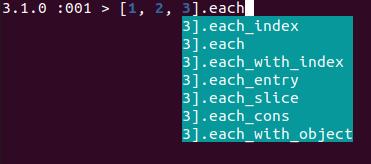

# Ruby 3.1

* **Released at:** Dec 25, 2021 (<a class="github" href="https://github.com/ruby/ruby/blob/ruby_3_1/NEWS.md">NEWS.md</a> file)
* **Status (as of Dec 25, 2025):** 3.1.7 is EOL
* **This document first published:** Jan 5, 2022
* **Last change to this document:** Dec 25, 2025

> **Note:** As already explained in [Introduction](README.md), this site is dedicated to changes in the **language**, not the **implementation**, therefore the list below lacks mentions of lots of important optimization introduced in 3.1, including a new JIT named YJIT. That's not because they are not important, just because this site's goals are different.

## Highlights[](#highlights)

The first major release after 3.0, Ruby 3.1 mostly dedicated to stabilizing new features like concurrency and pattern-matching, but also introduces a bunch of new features.

* [Hash literal value omission](3.1.html#values-in-hash-literals-and-keyword-arguments-can-be-omitted)
* [Anonymous block argument](3.1.html#anonymous-block-argument)
* [Pattern-matching: pinning of expressions](3.1.html#expressions-and-non-local-variables-allowed-in-pin-operator)
* [`Time`: better support for timezones in construction](3.1.html#in-parameter-for-constructing-time)
* [Low-level `IO::Buffer`](3.1.html#iobuffer)
* [More methods become async with fiber scheduler](3.1.html#fiber-scheduler-new-hooks)

_**See also my [this year's ongoing post series](https://zverok.substack.com/p/what-you-can-learn-by-merely-writing) on the making of the changelog and Ruby development process.**_

## Language changes[](#language-changes)

### Values in Hash literals and keyword arguments can be omitted[](#values-in-hash-literals-and-keyword-arguments-can-be-omitted)

In hash literals and method calls, `x:` is now a shortcut for `x: x`—take hash value from the context, with the same name as a key.

* **Discussion:** <a class="tracker feature" href="https://bugs.ruby-lang.org/issues/14579">Feature #14579</a>
* **Documentation:**  <a class="ruby-doc" href="https://docs.ruby-lang.org/en/3.1/syntax/literals_rdoc.html#label-Hash+Literals">doc/syntax/literals.rdoc#Hash Literals</a>, <a class="ruby-doc" href="https://docs.ruby-lang.org/en/3.1/syntax/calling_methods_rdoc.html#label-Keyword+Arguments">doc/methods.rdoc#Keyword Arguments</a>, <a class="ruby-doc" href="https://docs.ruby-lang.org/en/3.1/Hash.html"><code>Hash</code></a>
* **Code:**
  ```ruby
  x, y = 100, 200
  # => [100, 200]
  # In hash literal
  h = {x:, y:}
  # => {:x=>100, :y=>200}

  # In method call
  p(x:, y:)
  # prints: "{:x=>100, :y=>200}"

  # Any context-available names work too, not only local variables:
  C = 'constant'
  # => "constant"
  def m()='method'
  # => :m
  {C:, m:}
  # => {:C=>"constant", :m=>"method"}

  # Undefined names behave like in any other context:
  {z:}
  # => undefined local variable or method `z' (NameError)

  # Dynamic symbols are not supported:
  name = 'x'
  {"#{name}":}
  #          ^
  # syntax error, unexpected '}' (SyntaxError)

  # ...including symbols produced from literal strings:
  {'x':}
  #    ^
  # syntax error, unexpected '}' (SyntaxError)
  ```
* **Notes:** Be aware, that using new feature in a method call without parenthesis might lead to unexpected effect:
  ```ruby
  # Useful "puts-debugging" technique: print variable values with names
  p(x:, y:)

  # ...but if you'll write it this way:
  p x:, y:
  x + y # ... some following code

  # It would be interpreted as this, for backward compatibility:
  p(x:, y: x + y)
  ```
  Therefore, if you use value omission in method calls, **always use parenthesis**!
* **Follow-ups:** It is [still discussed](https://bugs.ruby-lang.org/issues/18396#note-4) whether Ruby should handle the problem above (unexpected continuation) more gracefully. It is possible that the behavior would change in a migration-friendly manner: first, the warning in 3.2 about `key:` at the end of the line; then, in 3.3, next line would be considered a separate statement.

### Inside "endless" method definitions, method calls without parenthesis are allowed[](#inside-endless-method-definitions-method-calls-without-parenthesis-are-allowed)

`def some_method = other_method "bar"` is now allowed, previously it was required to write `other_method("bar")` in the method's body.

* **Reason:** When endless methods were introduced in 3.0, this syntax (named "command syntax" internally) wasn't allowed; but it was not a deliberate decision, and rather a side-effect of a parser complexity. During development of 3.1, the workaround was found to make code more consistent and refactoring from multi-line to single-line methods easier.
* **Discussion:** <a class="tracker feature" href="https://bugs.ruby-lang.org/issues/17398">Feature #17398</a>
* **Documentation:** — (<a class="ruby-doc" href="https://docs.ruby-lang.org/en/3.1/syntax/methods_rdoc.html"><code>doc/syntax/methods.rdoc</code></a> doesn't mention new or old behavior.)
* **Code:**
  ```ruby
  def log(msg) = puts "#{Time.now}: #{msg}"
  # 3.0: syntax error, unexpected string literal, expecting `do' or '{' or '('
  # 3.1: successfully defined
  ```

### Anonymous block argument[](#anonymous-block-argument)

If method uses its block argument only to pass to another method, it can be marked by anonymous `&`.

* **Reason:** The initial proposal for the feature is 6-year old and focused on avoiding intermediate blocks object allocation on block forwarding. It was considered redundant when block forwarding was optimized in Ruby 2.5; but then the core team decided it is actually a nice and unambiguous shortcut for methods that just pass the block further. As block argument is frequently called just `block`, the absence of the name doesn't affect readability.
* **Discussion:** <a class="tracker feature" href="https://bugs.ruby-lang.org/issues/11256">Feature #11256</a>
* **Documentation:** <a class="ruby-doc" href="https://docs.ruby-lang.org/en/3.1/syntax/methods_rdoc.html#label-Block+Argument">doc/syntax/methods.rdoc#Block Argument</a>
* **Code:**
  ```ruby
  def logged_open(filename, &)
    puts "Opening #{filename}..."
    File.open(filename, &)
  end

  logged_open('README.md') { puts _1.read(100) }
  # Prints:
  #  Opening README.md
  #  ...first 100 chars of README.md...

  # Attempt to use `&` inside a method without block parameter is an error:
  def filter(data)= data.select(&)
  # => no anonymous block parameter (SyntaxError)

  # ...and with named block parameter too
  def filter(data, &block)= data.filter(&)
  # => no anonymous block parameter (SyntaxError)

  # If you temporary want to catch a block in the method, `Kernel#proc` will help:
  def filter(data, &)
    block = proc(&)
    p block, block.call(5)
    data.filter(&)
  end
  # => :filter
  filter(1..10, &:odd?)
  # Prints:
  #  #<Proc:0x00007fe9842fa308(&:odd?) (lambda)>
  #  true
  # => [1, 3, 5, 7, 9]
  ```

### Pattern-matching[](#pattern-matching)

* **One-line pattern matching ([both](3.0.html#one-line-pattern-matching-with-) [versions](3.0.html#in-as-a-truefalse-check)) is no longer experimental**

#### Expressions and non-local variables allowed in pin operator `^`[](#expressions-and-non-local-variables-allowed-in-pin-operator-)

On the initial implementation of the pattern matching, the only patterns that could've been used in matching expression were constants, literals and pinned local variables. Since 3.1, any kind of statement can be a pattern, with extended functionality of the `^` pin operator.

* **Discussion:** <a class="tracker feature" href="https://bugs.ruby-lang.org/issues/17411">Feature #17411</a> (pinning expressions), <a class="tracker feature" href="https://bugs.ruby-lang.org/issues/17724">Feature #17724</a> (pinning class/global variables)
* **Documentation:** <a class="ruby-doc" href="https://docs.ruby-lang.org/en/3.1/syntax/pattern_matching_rdoc.html#label-Variable+pinning">doc/syntax/pattern_matching.rdoc#Variable pinning</a>
* **Code:**
  ```ruby
  # In Ruby 3.0, this was possible:
  {version: 12} in {version: 10..15} # range literal as a pattern
  # => true

  # But this was not, despite being intuitively similar:
  {timestamp: Time.now} in {timestamp: (Time.new(2021)..Time.new(2022))}
  # syntax error

  # In 3.1, this is possible with pinning:
  {timestamp: Time.now} in {timestamp: ^(Time.new(2021)..Time.new(2022))}
  # => true

  # Any complex expression is possible
  # ...consider years.txt has lines like "2021-2025", some ranges of years.
  Time.now.year in ^(File.read('years.txt').lines.first.then { _1.split('-') }.then { _1.to_i.._2.to_i })

  # parenthesis are mandatory, this wouldn't work:
  Time.now.year in ^rand(2021..2023)
  # syntax error
  ```

#### Parentheses can be omitted in one-line pattern matching.[](#parentheses-can-be-omitted-in-one-line-pattern-matching)

* **Discussion:** <a class="tracker feature" href="https://bugs.ruby-lang.org/issues/16182">Feature #16182</a>
* **Documentation:** <a class="ruby-doc" href="https://docs.ruby-lang.org/en/3.1/syntax/pattern_matching_rdoc.html#label-Patterns"><code>doc/syntax/pattern_matching.rdoc#Patterns</code></a>
* **Code:**
  ```ruby
  [0, 1] => _, x
  # 3.0:
  #   syntax error, unexpected ',', expecting `end'
  #   [0, 1] => _, x
  #              ^
  # 3.1: success:
  x #=> 1

  {y: 2} => y:
  # 3.0
  #   syntax error, unexpected label)
  #   {y: 2} => y:
  #             ^~
  # 3.1: success:
  y #=> 2

  # Works with in: syntax, too:
  if {language: 'Ruby', version: '3.1'} in version: ('3.0'..)
    puts "Pattern-matching is cool"
  end
  # 3.0: syntax error
  # 3.1: Prints "Pattern-matching is cool"
  ```

### Multiple assignment evaluation order change[](#multiple-assignment-evaluation-order-change)

* **Reason:** Multiple assignment evaluation order was unexpected: the right part of the expression was calculated before the left. While rarely crucial, this still could cause subtle bugs.
* **Discussion:** <a class="tracker bug" href="https://bugs.ruby-lang.org/issues/4443">Bug #4443</a>
* **Documentation:** —
* **Code:**
  ```ruby
  def left1
    puts "left1"
    []
  end

  def left2
    puts "left2"
    []
  end

  def right1
    puts "right1"
    1
  end

  def right2
    puts "right2"
    2
  end

  left1[0] = right1
  # Both Ruby 3.0 and 3.1: prints left1, right1 -- the left side calculated first

  left1[0], left2[0] = right1, right2
  # 3.0: prints right1, right2, left1, left2 -- right side calculated first
  # 3.1: prints left1, left2, right1, right2 -- consistent with singular assignment
  ```

## Core classes and modules[](#core-classes-and-modules)

### `Class` and `Module`[](#class-and-module)

#### `Class#subclasses`[](#classsubclasses)

Returns all _direct_ subclasses of the class.

* **Discussion:** <a class="tracker feature" href="https://bugs.ruby-lang.org/issues/18273">Feature #18273</a>
* **Documentation:** <a class="ruby-doc" href="https://docs.ruby-lang.org/en/3.1/Class.html#method-i-subclasses"><code>Class#subclasses</code></a>
* **Code:**
  ```ruby
  class A
  end

  class B < A
  end

  class C < B
  end

  A.subclasses #=> [B] -- only direct descendants, no grand-children

  class << A
  end

  A.subclasses #=> [B] -- singleton class is not included either

  # Dynamic subclasses are included:
  c = Class.new(A)
  A.subclasses
  # => [#<Class:0x00007f3e45907858>, B]

  # Note that `.subclasses` doesn't hold references to the descendants, and therefore doesn't prohibit
  # them from being garbage-collected
  c = nil
  GC.start
  A.subclasses
  # => [B] -- dynamic class is gone
  ```
* **Notes:** Almost till the final release, method `#descendants` (returning all descendants, not only direct one) was also been introduced. But then Matz had a [change of mind](https://bugs.ruby-lang.org/issues/14394#note-33) and decided `#subclasses` covers most of the reasonable needs, and `#descendants` introduces too much complexity. It still might be considered for the future versions.

#### `Refinement` class[](#refinement-class)

The class of the context (`self`) available inside the `refine SomeClass do ... end`, and a new private method: `Refinement#import_methods`

* **Reason:** The `include`/`extend` in refinements never worked (refined class wouldn't have the modules included) but were allowed. `import_methods` were introduced as a compromise replacement, limited in functionality (see **Notes**).
* **Discussion:** <a class="tracker bug" href="https://bugs.ruby-lang.org/issues/17429">Bug #17429</a>
* **Documentation:** <a class="ruby-doc" href="https://docs.ruby-lang.org/en/3.1/Refinement.html"><code>Refinement</code></a>
* **Code:**
  ```ruby
  module AsJSON
    def as_json_data
      JSON.parse(to_json, symbolize_names: true)
    end
  end

  Warning[:deprecated] = true # To see the warning below

  module JSONizer
    refine Array do
      include AsJSON
      # warning: Refinement#include is deprecated and will be removed in Ruby 3.2

      import_methods AsJSON
    end

    refine Hash do
      import_methods AsJSON
    end
  end

  using JSONizer

  [:bar, /baz/, Time.now].as_json_data
  # => ["bar", "(?-mix:baz)", "2021-12-25 20:47:29 +0200"]
  {'value' => 1/3r}.as_json_data
  # => {:value=>"1/3"}
  ```
* **Notes:** Unlike module including, `import_methods` works by copying the methods bytecode to refined objects. Thus only methods defined in Ruby can be imported (because methods defined in C—including core methods—don't have bytecode). This somewhat limits the usability of the feature:
  ```ruby
  module Binread
    # try to temporarily make string into a byte-sequence...
    refine String do
      def each(&)
        each_byte(&)
      end
      import_methods Enumerable
      # Can't import method which is not defined with Ruby code: Enumerable#drop (ArgumentError)
    end
  end
  ```
* **Follow-ups:** In Ruby 3.2, several usability improvments using the new class [were introduced](3.2.html#refinements): ability to ask which refinements some module defines, which refinements are active in the current context, and what class or module the particular refinement refines.

#### `Module#prepend` behavior change[](#moduleprepend-behavior-change)

Now, when module is prepended to the class, it always becomes first in the ancestor chain; even if it was already included.

* **Reason:** It was noted that `prepend` is a mechanism of method redefinition that is relied upon to be performed strictly _before_ the module of the class affected; but if the class had the module already ws included (especially in complex systems and indirectly), this becomes unreliable.
* **Discussion:** <a class="tracker bug" href="https://bugs.ruby-lang.org/issues/17423">Bug #17423</a>
* **Documentation:** <a class="ruby-doc" href="https://docs.ruby-lang.org/en/3.1/Module.html#method-i-prepend"><code>Module#prepend</code></a> _(not that it actually documents new—or old—behavior)_
* **Code:**
  ```ruby
  module M
    def foo
      ["In M", *(super rescue nil)]
    end
  end

  class A
    def foo
      ["in A", *(super rescue nil)]
    end
  end

  A.include M
  A.prepend M

  A.ancestors
  # 3.0: => [A, M, Object, Kernel, BasicObject]
  # 3.1: => [M, A, M, Object, Kernel, BasicObject]
  A.new.foo
  # 3.0: => ["in A", "In M"] -- only method from included module is executed
  # 3.1: => ["In M", "in A", "In M"] -- both included AND prepended methods are executed

  # Note that relation is not symmetric: if the `prepend` happened first, `include` wouldn't affect
  # ancestors chain at all:
  class B
    def foo
      ["in B", *(super rescue nil)]
    end
  end

  B.prepend M
  B.include M

  B.ancestors
  # => [M, B, Object, Kernel, BasicObject] -- both in 3.0 and 3.1
  B.new.foo
  # => ["In M", "in B"]
  ```

#### `Module#private`, `#public`, `#protected`, and `#module_function` return their arguments[](#moduleprivate-public-protected-and-module_function-return-their-arguments)

* **Reason:** Allows to chain method decoration DSLs, like `memoize private :method_name`. Follows [similar in spirit](3.0.html#improved-method-visibility-declaration) changes of `attr_reader`/`attr_writer` behavior in Ruby 3.0
* **Discussion:** <a class="tracker feature" href="https://bugs.ruby-lang.org/issues/12495">Feature #12495</a>
* **Documentation:** <a class="ruby-doc" href="https://docs.ruby-lang.org/en/3.1/Module.html#method-i-private"><code>Module#private</code></a>,   <a class="ruby-doc" href="https://docs.ruby-lang.org/en/3.1/Module.html#method-i-public"><code>Module#public</code></a>, <a class="ruby-doc" href="https://docs.ruby-lang.org/en/3.1/Module.html#method-i-protected"><code>Module#protected</code></a>, <a class="ruby-doc" href="https://docs.ruby-lang.org/en/3.1/Module.html#method-i-module_function"><code>Module#module_function</code></a>
* **Code:**
  ```ruby
  p private # global private making all the method below private
  # => nil

  p private def m; end
  # => :m

  def m1; end
  def m2; end
  p private :m1, :m2
  # => :m1, :m2

  # Usage:
  require 'memoist'
  extend Memoist

  # This works: because memoize returns :m, and private receives it
  private memoize def m
    # ...
  end
  # In 3.0 this didn't work, but in 3.1, this does:
  memoize private def m
    # ...
  end
  ```

### `Method`/`UnboundMethod`: `#public?`, `#private?`, `#protected?`[](#methodunboundmethod-public-private-protected)

* **Reason:** For exploration, documenting, and metaprogramming (like, defining a wrapper method that would have the same visibility as original method).
* **Discussion:**  <a class="tracker feature" href="https://bugs.ruby-lang.org/issues/11689">Feature #11689</a>
* **Documentation:** <a class="ruby-doc" href="https://docs.ruby-lang.org/en/3.1/Method.html#method-i-private-3F"><code>Method#private?</code></a>, <a class="ruby-doc" href="https://docs.ruby-lang.org/en/3.1/UnboundMethod.html#method-i-private-3F"><code>UnboundMethod#private?</code></a>
* **Code:**
  ```ruby
  class A
    def m1
    end

    private def m2
    end
  end

  m1 = A.instance_method(:m1)
  # => #<UnboundMethod: A#m1() >
  m1.private?
  # => false
  m1.public?
  # => true

  m2 = A.new.method(:m2)
  # => #<Method: A#m2()>
  m2.private?
  # => true
  ```
* **Notes:** Another idea discussed was just having `Method#visibility`, but it was hard to decide on the method's name and what it should return, while three predicates are more or less obvious.
* **Follow-up:** [Reverted](3.2.html#methodpublic-protected-and-private-are-removed) in Ruby 3.2: it was considered after all that visibility is not a property of the method, but rather the responsibility of its owner.

### `Kernel#load`: module as a second argument[](#kernelload-module-as-a-second-argument)

`load(filename, module)` now evaluates `filename`'s code in the context of the `module`.

* **Reason:** The long-requested feature (the request is created almost 10 years ago!) might be useful for implementing simple helper libraries with a few unscoped methods/classes, and then scoping them while loading.
* **Discussion:** <a class="tracker feature" href="https://bugs.ruby-lang.org/issues/6210">Feature #6210</a>
* **Documentation:** <a class="ruby-doc" href="https://docs.ruby-lang.org/en/3.1/Kernel.html#method-i-load"><code>Kernel#load</code></a>
* **Code:**
  ```ruby
  # Assuming the following file test-load.rb
  ENV={a: 1}

  def puts(*)
    raise NotImplementedError
  end

  class String
    def debug = p("Hello from test string")
  end

  print "Additional module loaded"

  # This would replace `ENV`, `puts` and extend core `String`, and pollute global scope with methods
  load 'test-load.rb'
  # prints "Additional module loaded"
  ENV
  # => {:a=>1}
  'test'.debug
  # prints "Hello from test string"
  puts 'bar'
  # NotImplementedError

  # This would not affect `ENV`, `puts`, and `String`, but the only use of the call would be for side-effects
  load 'test-load.rb', true
  # prints "Additional module loaded"
  ENV
  # => ...system ENV...
  'test'.debug
  # undefined method `debug' for "test":String
  puts 'bar'
  # ...prints as usual

  # 3.1+
  # This would add `ENV`, `puts` and `String` to `Context`, and will make methods available as `foo`
  module M; end
  load 'test-load.rb', M
  # prints "Additional module loaded"
  ENV
  # => ...system ENV...
  M::ENV
  # => {:a=>1}
  M::String.new.debug
  # prints "Hello from test string"
  M.instance_method(:puts)
  # => #<UnboundMethod: M#puts() test-load.rb:3> -- can be used by including M into some other module/class

  # Note that `load` wouldn't load into class:
  class C; end
  load 'test-load.rb', C # the call is successful, but C treated as just truthy value (wrap=true)
  C::ENV
  # uninitialized constant C::ENV (NameError)
  ```
* **Notes:** Scoping into a module is transitive for other `load` calls: if the loaded file `load`s more files, they also will be scoped into the module. But it is not transitive for `require`:
  ```ruby
  # assuming in test-load2.rb
  class Integer
    def debug = p "debug Int"
  end
  # ...and in test-load.rb
  load 'test-load2.rb'

  # then if we do
  module M; end
  load 'test-load.rb', M
  M::Integer.new.debug
  # prints "debug Int"

  # ...but if in test-load.rb we'll have this:
  require './test-load2'
  # ...then
  load 'test-load.rb', M
  M::Integer.debug
  # uninitialized constant M::Integer (NameError)
  1.debug
  # prints "debug Int"
  ```

### Integer.try_convert[](#integertry_convert)

Safe explicit conversion methods, which calls `#to_int` if the argument has it, and returns `nil` otherwise.

* **Reason:** The similar methods exist on a few other core classes, like String and Array. They are useful for implementing polymorphic methods (like `#[]` behaving differently for integer, string and range), as a safe way of type-checking/type-coercion.
* **Discussion:** <a class="tracker feature" href="https://bugs.ruby-lang.org/issues/15211">Feature #15211</a>
* **Documentation:** <a class="ruby-doc" href="https://docs.ruby-lang.org/en/3.1/Integer.html#method-c-try_convert"><code>Integer.try_convert</code></a>
* **Code:**
  ```ruby
  Integer.try_convert(1) #=> 1
  Integer.try_convert(1.3) #=> 1
  Integer.try_convert(3/2r) #=> 1
  require 'bigdecimal'
  Integer.try_convert(BigDecimal('100000000000000000000000000000000000000000000000000000000000000'))
  #=> 100000000000000000000000000000000000000000000000000000000000000

  # If the object doesn't have #to_int, returns `nil`
  Integer.try_convert('1') #=> nil

  class MyNumber
    def to_int
      1.3
    end
  end

  # If #to_int doesn't return Integer, the error is raised (even if the result is convertable)
  Integer.try_convert(MyNumber.new)
  #=> `try_convert': can't convert MyNumber to Integer (MyNumber#to_int gives Float) (TypeError)

  # Usage in some array-alike slicing API:
  def slice(index)
    idx = Integer.try_convert(index) or
      raise ArgumentError, "Expected argument convertible to Integer, got #{index}"
    # Now `idx` is safe to use even for low-level APIs like memory addressing, it is definitely
    # Integer, even if some Float was passed initially.
  ```

### `String#unpack` and `#unpack1`: `offset:` argument[](#stringunpack-and-unpack1-offset-argument)

The new argument allows to unpack data starting from the specified offset.

* **Reason:** Handy for working with binary data of complicated shape, flow like: read one byte, decide what type/size is next data, then read this number of bytes _starting after the type tag_, then read next chunk _starting after the data already read_. Before the parameter introduction, this type of processing required string slicing, which is cumbersome and might've been inefficient.
* **Discussion:** <a class="tracker feature" href="https://bugs.ruby-lang.org/issues/18254">Feature #18254</a>
* **Documentation:** <a class="ruby-doc" href="https://docs.ruby-lang.org/en/3.1/String.html#method-i-unpack"><code>String#unpack</code></a>, <a class="ruby-doc" href="https://docs.ruby-lang.org/en/3.1/String.html#method-i-unpack1"><code>String#unpack1</code></a>
* **Code:**
  ```ruby
  # imagine it is "type tag 1 + data in four 32-bit integers"
  data = [1, 1991, 1995, 1998, 2003].pack('CL*')
  # => "\x01\xC7\a\x00\x00\xCB\a\x00\x00\xCE\a\x00\x00\xD3\a\x00\x00"
  tag = data.unpack1('c')
  # => 1
  data.unpack('L*', offset: 1)
  # => [1991, 1995, 1998, 2003]

  # Negative offsets or out-of-bounds ones don't work
  data.unpack('L*', offset: -1)
  # in `unpack': offset can't be negative (ArgumentError)
  data.unpack('L*', offset: 20)
  # in `unpack':  offset outside of string (ArgumentError)

  # 0 works, being the same as no offset
  data.unpack('c', offset: 0)
  # => [1]
  ```

### `MatchData#match` and `#match_length`[](#matchdatamatch-and-match_length)

`#match(idx)` is the same as `MatchData#[]`, but only works for singular numeric or symbolic index. `#match_length(idx)` returns the length of the `idx`s match.

* **Reason:** It was argued that in the performance-critical code sometimes there is a need to just know the length of the substring matched, and doing it via `match[index].length` leads to creation of an intermediate string soon to be dropped, while `#match_length` doesn't do that. `#match` is added mostly for completeness (it would be weird to not have it when `#match_length` method exists).
* **Discussion:** <a class="tracker feature" href="https://bugs.ruby-lang.org/issues/18172">Feature #18172</a>
* **Documentation:** <a class="ruby-doc" href="https://docs.ruby-lang.org/en/3.1/MatchData.html#method-i-match"><code>MatchData#match</code></a>, <a class="ruby-doc" href="https://docs.ruby-lang.org/en/3.1/MatchData.html#method-i-match_length"><code>MatchData#match_length</code></a>
* **Code:**
  ```ruby
  m = "Ruby 3.1 is released December 25, 2021".match(/Ruby (?<version>\d\.\d) .* (?<year>\d{4})/)
  # => #<MatchData "Ruby 3.1 is released December 25, 2021" version:"3.1" year:"2021">
  m.match(1)
  # => "3.1"
  m.match(:version)
  # => "3.1"
  m.match('version')
  # => "3.1"
  m.match_length(:version)
  # => 3
  m.match(2)
  # => "2021"
  m.match_length(2)
  # => 4
  m.match(3)
  # in `match': index 3 out of matches (IndexError)
  m.match_length(3)
  # in `match_length': index 3 out of matches (IndexError)

  # ...unlike #[]
  m[3]
  # => nil

  # Realistic usage:
  text = "My credit card number is 5221-1234-5678-9000 (not really)"
  text.gsub!(/(\d{4})-(\d{4})-(\d{4})-(\d{4})/) {
    m = Regexp.last_match
    "#{m.match(1)}-#{'*' * m.match_length(2)}-#{'*' * m.match_length(3)}-#{m.match(4)}"
   }
   # => "My credit card number is 5221-****-****-9000 (not really)"
  ```

### `Time`[](#time)

#### `in:` parameter for constructing time[](#in-parameter-for-constructing-time)

The new parameter is accepting offsets or timezone objects, and (finally!) allows to easily construct time in desired timezone.

* **Discussion:** <a class="tracker feature" href="https://bugs.ruby-lang.org/issues/17485">Feature #17485</a>
* **Documentation:** <a class="ruby-doc" href="https://docs.ruby-lang.org/en/3.1/Time.html#method-c-new"><code>Time.new</code></a>, <a class="ruby-doc" href="https://docs.ruby-lang.org/en/3.1/Time.html#method-c-at"><code>Time.at</code></a>, <a class="ruby-doc" href="https://docs.ruby-lang.org/en/3.1/Time.html#method-c-now"><code>Time.now</code></a>
* **Code:**
  ```ruby
  Time.new(2021, 12, 24, in: '+09:00')
  # => 2021-12-24 00:00:00 +0900
  Time.new(2021, 12, 24, in: 'UTC')
  #  => 2021-12-24 00:00:00 UTC

  # This was previously possible only with "pass all params" signature
  # Ruby 3.0: tz was only a positional argument:
  Time.new(2021, 12, 24, 0, 0, 0, '+09:00')
  # => 2021-12-24 00:00:00 +0900

  # This was previously not possible to do in one call: ::now with timezone
  Time.now(in: '+09:00')
  # => 2021-12-21 18:33:51.583436226 +0900
  Time.now
  # => 2021-12-21 11:34:00.258235705 +0200 -- my local timezone, for comparison

  # This was not possible either: ::at with timezone
  timestamp = Time.now.to_i
  # => 1640079354
  Time.at(timestamp, in: '+09:00')
  # => 2021-12-21 18:35:54 +0900

  # Timezone objects are supported, too
  require 'tzinfo'
  zone = TZInfo::Timezone.get('America/New_York')
  Time.now(in: zone)
  # => 2021-12-21 04:37:25.522169768 -0500
  Time.now(in: zone).zone
  # => #<TZInfo::DataTimezone: America/New_York>
  ```

#### `#strftime` supports `-00:00` offset[](#strftime-supports--0000-offset)

`%-z` allows to format "negative zero" offset for Time.

* **Reason:** RFC 3339 [defines a nuance](https://datatracker.ietf.org/doc/html/rfc3339#section-4.3) of offset formatting: offset `"+00:00"` in some service response declares that UTC is the preferred timezone for some context; while `"-00:00"` declares that preferred timezone is unknown, that's why data is in UTC.
* **Discussion:** <a class="tracker feature" href="https://bugs.ruby-lang.org/issues/17544">Feature #17544</a>
* **Documentation:** <a class="ruby-doc" href="https://docs.ruby-lang.org/en/3.1/Time.html#method-i-strftime"><code>Time#strftime</code></a>
* **Code:**
  ```ruby
  t = Time.now.utc
  # => 2021-12-26 18:47:52.979940556 UTC -- yeah, I am still working on a changelog a day after the release :(
  t.strftime('%H:%M%z')
  # => "18:47+0000"
  t.strftime('%H:%M%-z')
  # => "18:47-0000"
  t.strftime('%H:%M%-:z')
  # => "18:47-00:00"
  t.strftime('%H:%M%-::z')
  # => "18:47-00:00:00"
  ```

### `Struct`[](#struct)

#### Warning on passing keywords to a non-keyword-initialized struct[](#warning-on-passing-keywords-to-a-non-keyword-initialized-struct)

* **Reason:** After keyword-inited stucts have been introduced, it is easy to forget the actual protocol of some struct, and try to initialized it with keyword arguments—which, if the struct is not keyword-inited, would raise no error, but produce an unexpected result.
* **Discussion:** <a class="tracker feature" href="https://bugs.ruby-lang.org/issues/16806">Feature #16806</a>
* **Code:**
  ```ruby
  Person = Struct.new(:name, :age)
  # Proper initialization:
  Person.new('Jane', 32)
  #=> #<struct Person name="Jane", age=32>

  # I forgot it is not initialized by keywords, expected to initialize both fields,
  # but it would actually be treated as Person.new({name: 'Jane', age: 32}, nil)
  Person.new(name: 'Jane', age: 32)
  # warning: Passing only keyword arguments to Struct#initialize will behave differently from Ruby 3.2. Please use a Hash literal like .new({k: v}) instead of .new(k: v).
  #=> #<struct Person name={:name=>"Jane", :age=>32}, age=nil>

  # If the struct is really initialized by a hash, use {} to signify you know what you do
  Locale = Struct.new(:translations)
  Locale.new({user: 'користувач', application: 'застосунок'})
  # => #<struct Locale translations={:user=>"користувач", :application=>"застосунок"}>
  # ...no warning produced

  # The warning is produced only if the hash is the ONLY argument
  Locale = Struct.new(:lang, :translations)
  Locale.new(:ua, user: 'користувач', application: 'застосунок')
  #=> #<struct Locale lang=:ua, translations={:user=>"користувач", :application=>"застосунок"}>
  # ...no braces necessary, no warning
  ```
* **Follow-up:** Since 3.2, following the warning, the structs [can be initialized](3.2.html#struct-can-be-initialized-by-keyword-arguments-by-default) by both keyword and positional argument when `keyword_init: true` is not defined.

#### `StructClass#keyword_init?`[](#structclasskeyword_init)

The method allows to check whether the `Struct`-produced class is initialized by keywords.

* **Reason:** Helpful for meta-programming and generic processing of data, like serializing/deserializing.
* **Discussion:** <a class="tracker feature" href="https://bugs.ruby-lang.org/issues/18008">Feature #18008</a>
* **Documentation:** <a class="ruby-doc" href="https://docs.ruby-lang.org/en/3.1/Struct.html#method-c-keyword_init-3F"><code>Struct.keyword_init?</code></a>
* **Code:**
  ```ruby
  Struct.new(:name, :age).keyword_init?                       #=> nil
  Struct.new(:name, :age, keyword_init: true).keyword_init?   #=> true
  Struct.new(:name, :age, keyword_init: false).keyword_init?  #=> false

  # Potential usage:
  def deserialize(struct_class, **data)
    if struct_class.keyword_init?
      struct_class.new(**data)
    else
      struct_class.new(*data.values)
    end
  end
  ```

### Collections and sequences[](#collections-and-sequences)

#### `Enumerable#compact` and `Enumerator::Lazy#compact`[](#enumerablecompact-and-enumeratorlazycompact)

* **Reason:** `#compact` was previously defined only on a particular classes like `Array` and `Hash`, but being a synonym for `reject(&:nil?)`, it is reasonable to have in generic `Enumerable`. Especially useful in lazy enumeration to produce still-lazy sequences with `compact` applied.
* **Discussion:** <a class="tracker feature" href="https://bugs.ruby-lang.org/issues/17312">Feature #17312</a>
* **Documentation:** <a class="ruby-doc" href="https://docs.ruby-lang.org/en/3.1/Enumerable.html#method-i-compact"><code>Enumerable#compact</code></a>, <a class="ruby-doc" href="https://docs.ruby-lang.org/en/3.1/Enumerator/Lazy.html#method-i-compact"><code>Enumerator::Lazy#compact</code></a>
* **Code:**
  ```ruby
  # quickly imitate some slow or infinite stream producing data with nils possible:
  stream = Enumerator.produce { [nil, 1, 'test'].sample }.lazy

  stream.compact.first(5)
  # 3.0: NoMethodError (undefined method `compact' for #<Enumerator::Lazy: #<Enumerator: #<Enumerator::Producer:0x000055e8ffd38388>:each>>)
  # 3.1: => ["test", 1, 1, "test", "test"]

  # In 3.0, this already worked, which made absence of .compact even more confusing:
  stream.reject(&:nil?).first(5)
  # => ["test", "test", 1, "test", 1]

  # Usage in regular enumerable objects:
  require 'set'
  Set[1, nil, 2].compact
  # 3.0: NoMethodError (undefined method `compact' for #<Set: {1, nil, 2}>)
  # 3.1: => [1, 2] -- not ideal (it would be better to see Set[1, 2]), but better
  ```
* **Notes:** `Hash`, despite being `Enumerable`, has its own [#compact] method definition since [Ruby 2.4](2.4.html#hashcompact-and-compact), which just removes all key-value pairs where values are `nil`.

#### `Enumerable#tally` now accepts an optional hash to count[](#enumerabletally-now-accepts-an-optional-hash-to-count)

The hash is updated with the new `tally` numbers, allowing to accumulate stats from several enumerables efficiently and succinctly.

* **Discussion:** <a class="tracker feature" href="https://bugs.ruby-lang.org/issues/17744">Feature #17744</a>
* **Documentation:** <a class="ruby-doc" href="https://docs.ruby-lang.org/en/3.1/Enumerable.html#method-i-tally"><code>Enumerable#tally</code></a>
* **Code:**
  ```ruby
  week1_shifts = ['John', 'Jane', 'Hassim', 'John', 'Olexa', 'Olexa', 'Jane']
  week2_shifts = ['Jane', 'Jane', 'Miranda', 'John', 'Hassim', 'Olexa', 'John']

  stats = {}
  week1_shifts.tally(stats)
  #=> {"John"=>2, "Jane"=>2, "Hassim"=>1, "Olexa"=>2}
  week2_shifts.tally(stats) # add it to the previous stats
  #=> {"John"=>4, "Jane"=>4, "Hassim"=>2, "Olexa"=>3, "Miranda"=>1}

  # Only hashes or objects implicitly convertible into hash are allowed:
  require 'ostruct'
  week1_shifts.tally(OpenStruct.new) # maybe having #[]= is enough?..
  # in `tally': can't convert OpenStruct to Hash (OpenStruct#to_hash gives NilClass) (TypeError)

  # Hash descendants can be used as argument
  gem 'hashie'
  require 'hashie'
  stats = Hashie::Mash.new # Subclass of Hash which allows `.key` access
  res = week1_shifts.tally(stats)
  # => {"John"=>2, "Jane"=>2, "Hassim"=>1, "Olexa"=>2}
  res.class
  # => Hashie::Mash
  res.John
  # => 2
  ```

#### `Enumerable#each_cons` and `#each_slice` return a receiver[](#enumerableeach_cons-and-each_slice-return-a-receiver)

* **Reason:** Before 3.1, both methods returned `nil`, making it inconvenient to use in chained computations. This was also inconsistent with `#each`, which returns a receiver.
* **Discussion:** [GH-1509]
* **Documentation:** <a class="ruby-doc" href="https://docs.ruby-lang.org/en/3.1/Enumerable.html#method-i-each_cons"><code>Enumerable#each_cons</code></a>, <a class="ruby-doc" href="https://docs.ruby-lang.org/en/3.1/Enumerable.html#method-i-each_slice"><code>Enumerable#each_slice</code></a>
* **Code:**
  ```ruby
  Item = Struct.new(:value, :next)

  list = ('a'..'e').map { Item.new(_1) }
                   .each_cons(2) { |item, next_item| item.next = next_item }
  # => [
  #   #<struct Item value="a", next=#<struct Item value="b", ...>,
  #   ...
  #   ...

  # Before Ruby 3.1, one would need to write:
  list = ('a'..'e').map { Item.new(_1) }
  # this would return nil, so can't be chained
  list.each_cons(2) { |item, next_item| item.next = next_item }
  ```

#### `Array#intersect?`[](#arrayintersect)

Method checks if two arrays intersect, e.g. have at least one item in common.

* **Reason:** Checking intersection is typical operation (is "current user roles intersect with admin roles?"), but without this method, it typically required to write `!(ary1 & ary2).empty?`, which is cumbersome and produces an intermediate array.
* **Discussion:** <a class="tracker feature" href="https://bugs.ruby-lang.org/issues/15198">Feature #15198</a>
* **Documentation:** <a class="ruby-doc" href="https://docs.ruby-lang.org/en/3.1/Array.html#method-i-intersect-3F"><code>Array#intersect?</code></a>
* **Code:**
  ```ruby
  [1, 2, 3, 4].intersect?([1, 11, 111]) #=> true
  [1, 2, 3, 4].intersect?([11, 111]) #=> false

  # As with other set-alike method, items comparison are performed with #eql? which is in some cases
  # stricter than #==
  [1] == [1.0]
  # => true
  [1].intersect?([1.0])
  # => false
  ```
* **Notes:**
  * As it is with <a class="ruby-doc" href="https://docs.ruby-lang.org/en/3.1/Array.html#method-i-26"><code>&</code></a>, the new method treats arrays as sets of values with order ignored, so the semantic is just "if any value of array 1 is present in array 2", not some more strict check (like "if elements at the end of array 1 are the same as elements at the beginning of array 2").
  * The complexity of the method is roughly `O(size1+size2)`.

####  `Thread::Queue#initialize`: initial values can be passed to initializer[](#threadqueueinitialize-initial-values-can-be-passed-to-initializer)

* **Reason:** Despite the fact that `Thread::Queue` is a specialized collection for safe data exchange in a multi-threaded context, it is considered to frequently have some initial set of values to process (like list of workers), new method call-sequence simplifies that.
* **Discussion:** <a class="tracker feature" href="https://bugs.ruby-lang.org/issues/17327">Feature #17327</a>
* **Documentation:** <a class="ruby-doc" href="https://docs.ruby-lang.org/en/3.1/Thread/Queue.html#method-c-new"><code>Thread::Queue.new</code></a>
* **Code:**
  ```ruby
  queue = Thread::Queue.new(['task1', 'task2', 'task3'])
  # => #<Thread::Queue:0x00007f434de1b800>

  producer = Thread.new do
    while !queue.empty?
      task = queue.pop
      puts "procesing #{task}"
    end
  end

  producer.join
  # procesing task1
  # procesing task2
  # procesing task3

  # Any class responding to #to_a, and any Enumerable can be used as a constructor:
  queue = Thread::Queue.new(File.open('tasks.csv').each_line)
  # => #<Thread::Queue:0x00007f434de18998>
  ```

### `IO::Buffer`[](#iobuffer)

A new class representing low-level I/O abstraction. Internally, uses OS mechanisms to directly use memory-mapping of files and internal Ruby String representation.

* **Reason:** The feature was requested for implementing non-blocking `#io_read` and `#io_write` for FiberScheduler, but probably will find other usages once matured.
* **Discussion:** <a class="tracker feature" href="https://bugs.ruby-lang.org/issues/18020">Feature #18020</a>
* **Documentation:** <a class="ruby-doc" href="https://docs.ruby-lang.org/en/3.1/IO/Buffer.html"><code>IO::Buffer</code></a>
* **Code:** _This is a big new class, see class' docs for detailed examples of usage, they are quite succinct._

### `File.dirname`: optional `level` to go up the directory tree[](#filedirname-optional-level-to-go-up-the-directory-tree)

* **Discussion:** <a class="tracker feature" href="https://bugs.ruby-lang.org/issues/12194">Feature #12194</a>
* **Documentation:** <a class="ruby-doc" href="https://docs.ruby-lang.org/en/3.1/File.html#method-c-dirname"><code>File.dirname</code></a>
* **Code:**
  ```ruby
  path = "/home/zverok/projects/ruby/README.md"
  File.dirname(path)
  # => "/home/zverok/projects/ruby"
  File.dirname(path, 1) # same as above
  # => "/home/zverok/projects/ruby"
  File.dirname(path, 2)
  # => "/home/zverok/projects"
  File.dirname(path, 3)
  # => "/home/zverok"
  File.dirname(path, 100)
  # => "/"
  File.dirname(path, 0) # no-op
  # => "/home/zverok/projects/ruby/README.md"
  File.dirname(path, -1)
  # in `dirname': negative level: -1 (ArgumentError)
  ```
* **Notes:** Unfortunately, <a class="ruby-doc" href="https://docs.ruby-lang.org/en/3.1/Pathname.html#method-i-dirname"><code>Pathname#dirname</code></a> is not updated to have a new argument.

### `Marshal.load` accepts a `freeze:` option[](#marshalload-accepts-a-freeze-option)

If the `freeze: true` is passed, `#load` will return deeply frozen object graph.

* **Reason:** Besides obvious immutability merits, constructing frozen graph may lead to lower memory consumption, because frozen strings are deduplicated.
* **Discussion:** <a class="tracker feature" href="https://bugs.ruby-lang.org/issues/18148">Feature #18148</a>
* **Documentation:** <a class="ruby-doc" href="https://docs.ruby-lang.org/en/3.1/Marshal.html#method-c-load"><code>Marshal.load</code></a>
* **Code:**
  ```ruby
  serialized = Marshal.dump(['value1', 'value2', 'value1', 'value2'])

  deserialized = Marshal.load(serialized)
  deserialized.map(&:frozen?)
  # => [false, false, false, false]
  deserialized.map(&:object_id)
  # => [1023900, 1023920, 1023940, 1023960] -- 4 different objects

  deserialized = Marshal.load(serialized, freeze: true)
  deserialized.map(&:frozen?)
  # => [true, true, true, true]
  deserialized.map(&:object_id)
  # => [1039360, 1039380, 1039360, 1039380] -- only 2 different objects, object_ids repeating

  # The only type of objects not frozen are class/module:
  MyType = Struct.new(:a, :b)
  serialized = Marshal.dump(MyType)
  deserialized = Marshal.load(serialized, freeze: true)
  deserialized.frozen? # => false
  # That's because Marshal.load doesn't "create" those objects, just finds the correspondence:
  Object.send(:remove_const, :MyType)
  Marshal.load(serialized)
  # undefined class/module MyType (ArgumentError)
  # ...therefore, making that corresponding module frozen would be unexpected
  ```

### Concurrency[](#concurrency)

#### `Thread#native_thread_id`[](#threadnative_thread_id)

Returns OS-specific thread ID.

* **Reason:** The method might be useful for low-level debugging, and for system calls requiring "real" thread id.
* **Discussion:** <a class="tracker feature" href="https://bugs.ruby-lang.org/issues/17853">Feature #17853</a>
* **Documentation:** <a class="ruby-doc" href="https://docs.ruby-lang.org/en/3.1/Thread.html#method-i-native_thread_id"><code>Thread#native_thread_id</code></a>
* **Code:**
  ```ruby
  # On my Ubuntu:

  Thread.current.native_thread_id
  # => 2735439
  t = Thread.new { sleep(1) }
  t.native_thread_id
  # => 2746533
  sleep(5) # -- allow t to finish (non-deterministic though!)
  t.native_thread_id
  # => nil
  ```
* **Notes:** It is documented that `native_thread_id` might change through the thread lifetime in Ruby implementations that use `M:N` threading model (e.g. `M` Ruby threads is mapped on `N` OS threads, with the nature of mapping decided by the interpreter).

#### `Process._fork`[](#process_fork)

The new method is the process forking implementation which is guaranteed to be used by both `Process.fork`, `Kernel#fork`, and `IO.popen`.

* **Reason:** The method is meant to be overridable by libraries that need to add some hook/additional processing (like freeing DB connections) on forking. Previously, this was inconvenient due to the fact that `Process.fork` and `Kernel#fork` were different methods, not relying on each other.
* **Discussion:** <a class="tracker feature" href="https://bugs.ruby-lang.org/issues/17795">Feature #17795</a>
* **Documentation:** <a class="ruby-doc" href="https://docs.ruby-lang.org/en/3.1/Process.html#method-c-_fork"><code>Process.\_fork</code></a>
* **Code:**
  ```ruby
  module ForkMonitor
    def _fork(...)
      puts "Before fork : in #{Process.pid}"
      super.tap { puts "After fork  : in #{Process.pid}" }
    end
  end

  Process.singleton_class.prepend(ForkMonitor)

  puts "Main process: in #{Process.pid}"
  pid = fork { puts "Forked body : in #{Process.pid}" }
  puts "Wating for       #{pid}"
  Process.waitpid(pid) if pid
  ```
  This prints:
  ```
  Main process: in 2052974
  Before fork : in 2052974
  After fork  : in 2052974
  Wating for       2052975
  After fork  : in 2052975  -- note that AFTER code is performed both for parent and child
  Forked body : in 2052975
  ```
* **Notes:**
  * The method should **never** be called directly; the only reason for it to exist is to be redefinable
  * The method should call `super`, and return what it had returned (it would become a return value of `fork`, e.g. child process' `pid`)

#### Fiber Scheduler: New hooks[](#fiber-scheduler-new-hooks)

Continuing work on non-blocking Fiber and Fiber Scheduler concept [introduced in 3.0](3.0.html#non-blocking-fiber-and-scheduler), new optional hooks were introduced to support non-blocking DNS resolution (`#address_resolve`), IO (`#io_read`/`#io_write`)

* **Discussion:** <a class="tracker feature" href="https://bugs.ruby-lang.org/issues/17370">Feature #17370</a> (`address_resolve`), <a class="tracker feature" href="https://bugs.ruby-lang.org/issues/17470">Feature #17470</a> (`timeout_after`), <a class="tracker feature" href="https://bugs.ruby-lang.org/issues/18020">Feature #18020</a> (`io_read` and `io_write`)
* **Documentation:** <a class="ruby-doc" href="https://docs.ruby-lang.org/en/3.1/Fiber/SchedulerInterface.html#method-i-address_resolve"><code>Fiber::SchedulerInterface#address_resolve</code></a>, <a class="ruby-doc" href="https://docs.ruby-lang.org/en/3.1/Fiber/SchedulerInterface.html#method-i-timeout_after"><code>Fiber::SchedulerInterface#timeout_after</code></a>, <a class="ruby-doc" href="https://docs.ruby-lang.org/en/3.1/Fiber/SchedulerInterface.html#method-i-io_read"><code>Fiber::SchedulerInterface#io_read</code></a>, <a class="ruby-doc" href="https://docs.ruby-lang.org/en/3.1/Fiber/SchedulerInterface.html#method-i-io_write"><code>Fiber::SchedulerInterface#io_write</code></a>
* **Code:** See code examples in [3.0 changelog](3.0.html#non-blocking-fiber-and-scheduler) for general demo of using Fiber Scheduler. As no simple implementation is available, it is complicated to show an example of new hooks in play.
* **Notes:**
  * Just to remind: Ruby does not include the default implementation of Fiber Scheduler, but the maintainer of the feature, Samuel Williams, provides one in his gem <a class="github" href="https://github.com/socketry/async">Async</a> which is Ruby 3.1-compatible already.
  * `IO::Buffer` (see above) introduced to provide a possibility for Fiber scheduler implementations to efficiently do the low-level I/O in a non-blocking manner.

#### Ractors can access module instance variables[](#ractors-can-access-module-instance-variables)

Ractors, [introduced in 3.0](3.0.html#ractors) to solve a problem of GVM (global virtual matchine lock), have a strict notion of "shareability". Non-main Ractors can't directly access any names defined outside of them except for classes/modules and frozen constants. One improvement was made to this model: allow to access module-wide instance variables.

* **Reason:** Calling `SomeClass.some_method` from inside Ractor is generally OK, unless the method changes the class'/module's internal variables (for example `SomeObject.new` maintains a global cache of all objects constructed)—in this case you'll see an `IsolationError`. So far, it corresponds to expectations of Ractor's data sharing model. But this expectation is broken if some of the module's methods uses immutable data stored in instance variable: intuitively it doesn't break isolation, but still didn't work. Now this limitation is relaxed.
* **Discussion:** <a class="tracker feature" href="https://bugs.ruby-lang.org/issues/17592">Feature #17592</a>
* **Documentation:** <a class="ruby-doc" href="https://docs.ruby-lang.org/en/3.1/Ractor.html#class-Ractor-label-Shareable+and+unshareable+objects">Ractor#Shareable and unshareable objects</a> (docs aren't updated yet)
* **Code:**
  ```ruby
  class APIClient < Struct.new(:version, :use_https, keyword_init: true)
    def self.setup!(**defaults)
      @defaults = defaults.freeze
    end

    def self.make
      new(**@defaults)
    end
  end

  APIClient.setup!(version: 1, use_https: true) # sets immutable instance variable @defaults

  Ractor.new {
    p APIClient.make # uses that variable, should be safe
    # 3.0: in `make': can not access instance variables of classes/modules from non-main Ractors (Ractor::IsolationError)
    # 3.1: => #<struct APIClient version=1, use_https=true>
  }.take
  ```

### Internals[](#internals)

#### `Thread::Backtrace.limit`[](#threadbacktracelimit)

Returns value set by `--backtrace-limit` command-line option (which is used in Exception#full_message to format backtrace).

* **Reason:** The ability to read the parameter might be useful for custom error formatters.
* **Discussion:** <a class="tracker feature" href="https://bugs.ruby-lang.org/issues/17479">Feature #17479</a>
* **Documentation:** <a class="ruby-doc" href="https://docs.ruby-lang.org/en/3.1/Thread/Backtrace.html#method-c-limit"><code>Thread::Backtrace.limit</code></a>
* **Code:** (in shell)
  ```
  $ ruby -r net/http -e "p Thread::Backtrace.limit; Net::HTTP.get(URI('http://wrong.address'))"
  −1
  .../lib/ruby/3.1.0/socket.rb:227:in `getaddrinfo': Failed to open TCP connection to wrong.address:80 (getaddrinfo: Name or service not known) (SocketError)
      from .../lib/ruby/3.1.0/socket.rb:227:in `foreach'
      from .../lib/ruby/3.1.0/socket.rb:632:in `tcp'
      from .../lib/ruby/3.1.0/net/http.rb:998:in `connect'
      from .../lib/ruby/3.1.0/net/http.rb:976:in `do_start'
      from .../lib/ruby/3.1.0/net/http.rb:965:in `start'
      from .../lib/ruby/3.1.0/net/http.rb:627:in `start'
      from .../lib/ruby/3.1.0/net/http.rb:503:in `get_response'
      from .../lib/ruby/3.1.0/net/http.rb:474:in `get'
  .../lib/ruby/3.1.0/socket.rb:227:in `getaddrinfo': getaddrinfo: Name or service not known (SocketError)
      from .../lib/ruby/3.1.0/socket.rb:227:in `foreach'
      from .../lib/ruby/3.1.0/socket.rb:632:in `tcp'
      from .../lib/ruby/3.1.0/net/http.rb:998:in `connect'
      from .../lib/ruby/3.1.0/net/http.rb:976:in `do_start'
      from .../lib/ruby/3.1.0/net/http.rb:965:in `start'
      from .../lib/ruby/3.1.0/net/http.rb:627:in `start'
      from .../lib/ruby/3.1.0/net/http.rb:503:in `get_response'
      from .../lib/ruby/3.1.0/net/http.rb:474:in `get'
      from -e:1:in `<main>'

  $ ruby --backtrace-limit 2 -r net/http -e "p Thread::Backtrace.limit; Net::HTTP.get(URI('http://wrong.address'))"
  2
  .../lib/ruby/3.1.0/socket.rb:227:in `getaddrinfo': Failed to open TCP connection to wrong.address:80 (getaddrinfo: Name or service not known) (SocketError)
      from .../lib/ruby/3.1.0/socket.rb:227:in `foreach'
      from .../lib/ruby/3.1.0/socket.rb:632:in `tcp'
       ... 7 levels...
  .../lib/ruby/3.1.0/socket.rb:227:in `getaddrinfo': getaddrinfo: Name or service not known (SocketError)
      from .../lib/ruby/3.1.0/socket.rb:227:in `foreach'
      from .../lib/ruby/3.1.0/socket.rb:632:in `tcp'
       ... 7 levels...

  $ ruby --backtrace-limit 0 -r net/http -e "p Thread::Backtrace.limit; Net::HTTP.get(URI('http://wrong.address'))"
  0
  .../lib/ruby/3.1.0/socket.rb:227:in `getaddrinfo': Failed to open TCP connection to wrong.address:80 (getaddrinfo: Name or service not known) (SocketError)
       ... 9 levels...
  .../lib/ruby/3.1.0/socket.rb:227:in `getaddrinfo': getaddrinfo: Name or service not known (SocketError)
       ... 9 levels...
  ```

#### `GC`: measuring total time[](#gc-measuring-total-time)

New methods added to measure time spent in garbage collection.

* **Discussion:** <a class="tracker feature" href="https://bugs.ruby-lang.org/issues/10917">Feature #10917</a>
* **Documentation:** <a class="ruby-doc" href="https://docs.ruby-lang.org/en/3.1/GC.html#method-c-measure_total_time"><code>GC.measure_total_time</code></a>, <a class="ruby-doc" href="https://docs.ruby-lang.org/en/3.1/GC.html#method-c-measure_total_time-3D"><code>GC.measure_total_time=</code></a>, <a class="ruby-doc" href="https://docs.ruby-lang.org/en/3.1/GC.html#method-c-stat"><code>GC.stat</code></a>, <a class="ruby-doc" href="https://docs.ruby-lang.org/en/3.1/GC.html#method-c-total_time"><code>GC.total_time</code></a>
* **Code:**
  ```ruby
  GC.total_time  # => 10903796 -- nanoseconds at script start
  GC.stat[:time] # => 10 -- milliseconds at script start

  30_000.times.map { Object.new }

  GC.start

  # After some GCing
  GC.total_time  # => 20483486 -- nanoseconds
  GC.stat[:time] # => 20 -- milliseconds

  GC.measure_total_time= false

  30_000.times.map { Object.new }

  GC.start

  # Measuring was disabled, same values as above
  GC.total_time  # => 20483486
  GC.stat[:time] # => 20
  ```
* **Notes:** It is stated that measurement can introduce overhead, but _it is enabled by default_.

#### `TracePoint.allow_reentry`[](#tracepointallow_reentry)

Normally, during handling of `TracePoint` event, all other active `TracePoint` handlers wouldn't be called. Since Ruby 3.1, the handler can wrap some of its code into `TracePoint.allow_reentry { ... }` and inside that block, other handlers (including the current one) _will_ be invoked.

* **Reason:** The issue was raised by author of the <a class="github" href="https://github.com/deivid-rodriguez/byebug">byebug</a> debugger. Debugging sessions are implemented with `TracePoint` API, and when the program is inside a debugging session, it is actually inside one of the handlers. Thus, all other libraries relying on `TracePoint` API would not work during the session—and one of them is <a class="github" href="https://github.com/fxn/zeitwerk">zeitwerk</a>, Rails code reloader.
* **Discussion:** <a class="tracker feature" href="https://bugs.ruby-lang.org/issues/15912">Feature #15912</a>
* **Documentation:** <a class="ruby-doc" href="https://docs.ruby-lang.org/en/3.1/TracePoint.html#method-c-allow_reentry"><code>TracePoint.allow_reentry</code></a>
* **Code:**
  ```ruby
  # Without reentry
  # ---------------

  line_handler = TracePoint.new(:line) do |tp| # invoked for each statement
    next if tp.path != __FILE__ # only work in this file
    puts "Line handler"
    binding.eval("class C; end")
  end.enable

  class_handler = TracePoint.new(:class) do |tp| # invoked for each class definition
    puts "Class handler"
  end.enable

  class B
  end

  # This script will print "Class handler" only once: when inside :line
  # handler, all other handlers are ignored, and `class C; end` is NOT invoking the class_handler


  # With reentry
  # ------------

  line_handler = TracePoint.new(:line) do |tp| # invoked for each statement
    next if tp.path != __FILE__ # only work in this file
    next if (__LINE__..__LINE__+3).cover?(tp.lineno) # don't be invoked from itself
    puts "Line handler"
    TracePoint.allow_reentry { binding.eval("class C; end") }
  end.enable

  class_handler = TracePoint.new(:class) do |tp| # invoked for each class definition
    puts "Class handler"
  end.enable

  class B
  end

  # This will print "Class handler" twice: inside allow_reentry block in :line
  # handler, other handlers are enabled.
  ```
* **Notes:** The default behavior (no reentry) is necessary to protect from infinite recursion; when allowing reentry, extreme precautions should be taken (note the second `if` inside `:line` handler: without it, every line inside the handler would invoke itself).

#### `$LOAD_PATH.resolve_feature_path` does not raise[](#load_pathresolve_feature_path-does-not-raise)

Since being added [in 2.6](2.6.html#rubyvmresolve_feature_path) (then named `RubyVM.resolve_feature_path`), the method have raised when the requested name wouldn't be found. It was fixed in 3.1 to just return `nil`.

* **Reason:** It was argued that raising `LoadError` makes method looks like it has a side effect instead of just being a query method, and makes it inconvenient to use.
* **Discussion:** <a class="tracker feature" href="https://bugs.ruby-lang.org/issues/16043">Feature #16043</a>
* **Documentation:** <a class="ruby-doc" href="https://docs.ruby-lang.org/en/3.1/globals_rdoc.html"><code>doc/globals.rdoc</code></a>
* **Code:**
  ```ruby
  $LOAD_PATH.resolve_feature_path('garbage111')
  # 3.0: LoadError (cannot load such file -- garbage111)
  # 3.1: => nil
  ```

## Standard library[](#standard-library)

By this release, most of the standard library is extracted to either _default_ or _bundled_ gems; their development happens in separate repositories, and changelogs are either maintained there, or absent altogether. Either way, their changes aren't mentioned in the combined Ruby changelog, and I'll not be trying to follow all of them.

> **[stdgems.org](https://stdgems.org/)** project has a nice explanations of default and bundled gems concepts, as well as a list of currently gemified libraries and links to their docs.

> "For the rest of us" this means libraries development extracted into separate GitHub repositories, and they are just packaged with main Ruby before release. It means you can do issue/PR to any of them independently, without going through more tough development process of the core Ruby.

A few changes to mention, though:

* Code from `securerandom/formatter.rb` (services to convert random numbers into various representations) is moved to `lib/random/formatter.rb`. It was under the `securerandom` for historical reasons, but defined `Random::Formatter` and included it into `Random` instances.
  * Discussion: <a class="tracker feature" href="https://bugs.ruby-lang.org/issues/18190">Feature #18190</a>
  * Docs: <a class="ruby-doc" href="https://docs.ruby-lang.org/en/3.1/Random/Formatter.html"><code>Random::Formatter</code></a>
  * Code:
    ```ruby
    Random.hex # NoMethodError: the method is not available in core Random

    # In Ruby 3.0, it required this to work, which was weird:
    require 'securerandom'
    Random.hex
    # => "f3a3839a10c84eef96bee3e1c3d0d60a"

    # Since Ruby 3.1:
    require 'random/formatter'
    Random.hex
    # => "d270131fead4ca327f64ef6bbcfd7f01"

    # Still works with SecureRandom, too:
    SecureRandom.hex
    # => "f1945af8640074d186acd1e1c9aa84fc"
    ```
* `Coverage#suspend` and `#resume` in built-in coverage measurement library:
  * Discussion: <a class="tracker feature" href="https://bugs.ruby-lang.org/issues/18176">Feature #18176</a>
  * Docs: <a class="ruby-doc" href="https://docs.ruby-lang.org/en/3.1/Coverage.html#method-c-suspend"><code>Coverage#suspend</code></a>, <a class="ruby-doc" href="https://docs.ruby-lang.org/en/3.1/Coverage.html#method-c-resume"><code>Coverage#resume</code></a>
* `Psych` library (which implements YAML parsing and is required on `require 'yaml`) switched to `safe_load` as a default behavior of `load`. See <a class="tracker bug" href="https://bugs.ruby-lang.org/issues/17866">Bug #17866</a>.
* `IRB` console received a large update, and now provides modern experience with autocomplete and hints:<br/>
  
* `Ripper` standard parser got updated too (without changing the version) to match new syntaxes, see [this blog post](https://kddnewton.com/2022/01/08/ripper-changelog-3.1.0.html) for details.

### Version updates[](#version-updates)

#### Default gems[](#default-gems)

* <a class="github" href="https://github.com/ruby/base64">base64</a> 0.1.1
* <a class="github" href="https://github.com/ruby/benchmark">benchmark</a> 0.2.0
* <a class="github" href="https://github.com/ruby/bigdecimal">bigdecimal</a> 3.1.1
* <a class="github" href="https://github.com/rubygems/rubygems/tree/master/bundler">bundler</a> 2.3.3
* <a class="github" href="https://github.com/ruby/cgi">cgi</a> 0.3.1
* <a class="github" href="https://github.com/ruby/csv">csv</a> 3.2.2
* <a class="github" href="https://github.com/ruby/date">date</a> 3.2.2
* <a class="github" href="https://github.com/ruby/did_you_mean">did_you_mean</a> 1.6.1
* <a class="github" href="https://github.com/ruby/digest">digest</a> 3.1.0
* <a class="github" href="https://github.com/ruby/drb">drb</a> 2.1.0
* <a class="github" href="https://github.com/ruby/erb">erb</a> 2.2.3
* <a class="github" href="https://github.com/ruby/error_highlight">error_highlight</a> 0.3.0
* <a class="github" href="https://github.com/ruby/etc">etc</a> 1.3.0
* <a class="github" href="https://github.com/ruby/fcntl">fcntl</a> 1.0.1
* <a class="github" href="https://github.com/ruby/fiddle">fiddle</a> 1.1.0
* <a class="github" href="https://github.com/ruby/fileutils">fileutils</a> 1.6.0
* <a class="github" href="https://github.com/ruby/find">find</a> 0.1.1
* <a class="github" href="https://github.com/ruby/io-console">io-console</a> 0.5.10
* <a class="github" href="https://github.com/ruby/io-wait">io-wait</a> 0.2.1
* <a class="github" href="https://github.com/ruby/ipaddr">ipaddr</a> 1.2.3
* <a class="github" href="https://github.com/ruby/irb">irb</a> 1.4.1
* <a class="github" href="https://github.com/flori/json">json</a> 2.6.1
* <a class="github" href="https://github.com/ruby/logger">logger</a> 1.5.0
* <a class="github" href="https://github.com/ruby/net-http">net-http</a> 0.2.0
* <a class="github" href="https://github.com/ruby/net-protocol">net-protocol</a> 0.1.2
* <a class="github" href="https://github.com/ruby/nkf">nkf</a> 0.1.1
* <a class="github" href="https://github.com/ruby/open-uri">open-uri</a> 0.2.0
* <a class="github" href="https://github.com/ruby/openssl">openssl</a> 3.0.0
* <a class="github" href="https://github.com/ruby/optparse">optparse</a> 0.2.0
* <a class="github" href="https://github.com/ruby/ostruct">ostruct</a> 0.5.2
* <a class="github" href="https://github.com/ruby/pathname">pathname</a> 0.2.0
* <a class="github" href="https://github.com/ruby/pp">pp</a> 0.3.0
* <a class="github" href="https://github.com/ruby/prettyprint">prettyprint</a> 0.1.1
* <a class="github" href="https://github.com/ruby/psych">psych</a> 4.0.3
* <a class="github" href="https://github.com/ruby/racc">racc</a> 1.6.0
* <a class="github" href="https://github.com/ruby/rdoc">rdoc</a> 6.4.0
* <a class="github" href="https://github.com/ruby/readline">readline</a> 0.0.3
* <a class="github" href="https://github.com/ruby/readline-ext">readline-ext</a> 0.1.4
* <a class="github" href="https://github.com/ruby/reline">reline</a> 0.3.0
* <a class="github" href="https://github.com/ruby/resolv">resolv</a> 0.2.1
* <a class="github" href="https://github.com/ruby/rinda">rinda</a> 0.1.1
* <a class="github" href="https://github.com/ruby/ruby2_keywords">ruby2_keywords</a> 0.0.5
* <a class="github" href="https://github.com/rubygems/rubygems">RubyGems</a> 3.3.3
* <a class="github" href="https://github.com/ruby/securerandom">securerandom</a> 0.1.1
* <a class="github" href="https://github.com/ruby/set">set</a> 1.0.2
* <a class="github" href="https://github.com/ruby/stringio">stringio</a> 3.0.1
* <a class="github" href="https://github.com/ruby/strscan">strscan</a> 3.0.1
* <a class="github" href="https://github.com/ruby/tempfile">tempfile</a> 0.1.2
* <a class="github" href="https://github.com/ruby/time">time</a> 0.2.0
* <a class="github" href="https://github.com/ruby/timeout">timeout</a> 0.2.0
* <a class="github" href="https://github.com/ruby/tmpdir">tmpdir</a> 0.1.2
* <a class="github" href="https://github.com/ruby/un">un</a> 0.2.0
* <a class="github" href="https://github.com/ruby/uri">uri</a> 0.11.0
* <a class="github" href="https://github.com/ruby/yaml">yaml</a> 0.2.0
* <a class="github" href="https://github.com/ruby/zlib">zlib</a> 2.1.1

#### Bundled gems[](#bundled-gems)

* <a class="github" href="https://github.com/seattlerb/minitest">minitest</a> 5.15.0
* <a class="github" href="https://github.com/ruby/power_assert">power_assert</a> 2.0.1
* <a class="github" href="https://github.com/ruby/rake">rake</a> 13.0.6
* <a class="github" href="https://github.com/test-unit/test-unit">test-unit</a> 3.5.3
* <a class="github" href="https://github.com/ruby/rexml">rexml</a> 3.2.5
* <a class="github" href="https://github.com/ruby/rbs">rbs</a> 2.0.0
* <a class="github" href="https://github.com/ruby/typeprof">typeprof</a> 0.21.1

### Standard library content changes[](#standard-library-content-changes)

* `lib/debug.rb` is replaced with <a class="github" href="https://github.com/ruby/debug">debug</a> gem
* new gem <a class="github" href="https://github.com/ruby/error_highlight">error_highlight</a> was introduced and is enabled by default, allowing more fine-grained error messages:
  ```ruby
  data = {body: {items: []}}
  data.dig(:body, :items, 0)[:title]
  # Ruby 3.0 prints:
  #   in `<main>': undefined method `[]' for nil:NilClass (NoMethodError)
  #
  # Ruby 3.1 prints:
  #   undefined method `[]' for nil:NilClass (NoMethodError)
  #
  #   data.dig(:body, :items, 0)[:title]
  #                             ^^^^^^^^
  ```

#### Default gems that became bundled[](#default-gems-that-became-bundled)

> Note: In bundler-enabled environment, some code using this libraries might require adding `gem "<gemname>"` into your `Gemfile`, otherwise they wouldn't be available.

* <a class="github" href="https://github.com/ruby/net-ftp">net-ftp</a> 0.1.3
* <a class="github" href="https://github.com/ruby/net-imap">net-imap</a> 0.2.2
* <a class="github" href="https://github.com/ruby/net-pop">net-pop</a> 0.1.1
* <a class="github" href="https://github.com/ruby/net-smtp">net-smtp</a> 0.3.1
* <a class="github" href="https://github.com/ruby/matrix">matrix</a> 0.4.2
* <a class="github" href="https://github.com/ruby/prime">prime</a> 0.1.2
* <a class="github" href="https://github.com/ruby/debug">debug</a> 1.4.0
